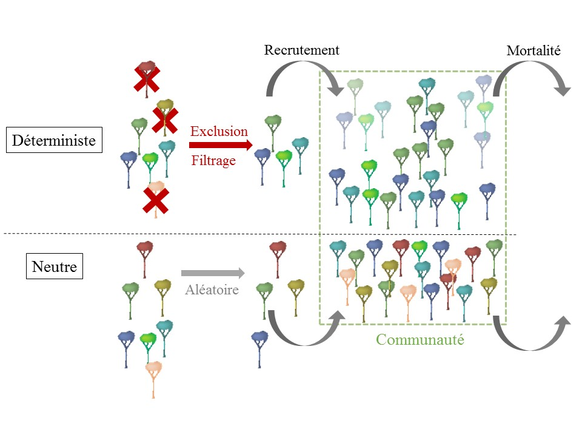

---
output:
  pdf_document: default
  html_document: default
---
# Introduction générale

## Les forêts tropicales humides, au coeur de l'avenir planétaire

Les forêts couvrent 30% de la surface terrestre et les nombreux biens et services environnementaux, économiques et sociaux qu'elles assurent sont indispensables à l'équilibre planétaire.
Elles régulent le climat, la qualité de l'eau, de l'air et des sols et abritent une diversité biologique exceptionnelle.
Elles subviennent aux besoins alimentaires de la population mondiale et permettent son développement économique en tant que source de matières premières, de revenus et d'opportunités de développement.
Enfin, indispensables au bien être des populations, elles représentent des valeurs historiques, culturelles et patrimoniales irremplaçables [@FRA2015; @Tilman2014].
Malgré leur importance les forêts restent extrêmement menacées par les changements climatiques globaux, le traffic de bois illégal, la déforestation liée aux changements d'usage des terres et les dégradations et pollutions environnementales.

### Des écosystèmes incontournables

Par "forêt" ou "ecosystème forestier" on entend les assemblages de plantes, animaux et microorganismes et leur environnement qui définissent une unité fonctionnelle dont les arbre sont les composants essentiels [@FRA2000]. 
Ces écosystèmes accueillent la diversité animale et végétale et les taux d'endémismes les plus importants du globe et sont les régions restées les moins anthropisées ce qui leur confère de forts enjeux de conservation [@Myers2000; @Mittermeier2003].

En entretenant les cycles de l'eau et des nutriments (azote, phosphore, etc) via leur réseau racinaire, les forêts régulent la fertilité des sols et les températures et les précipitations locales [@Malhi2008; @Isbell2017].
Elles sont également des puits de carbone qui représentent 1.1 ± 0.8 PgC.yr^–1^ et jouent un rôle majeur dans la régulation des gaz à effet de serre (*GES*), d'une part en tant que puit de carbone qui compense les émissions de GES mais également an tant que source potentielle lorsque leur dégradation libère le carbone stocké dans leur biomasse [@Pan2011; @Roy2017].

A l'échelle globale la subsistance de 500 millions de personnes dépend directement des forêts qui sont une source de biens allant de la nourriture (par la chasse et la collecte de produits forestiers non ligneux comestibles), à l'eau, aux matériaux de construction, et à l'énergie (par l'utilisation du bois de chauffage et de cuisson des aliments). 
L'exploitation forestière quant à elle représentait ~ 1% du PIB mondial, une part importante de l'emploi et l'une des principales sources d'énergie en 2011 [@CBDdiversity2011; @FAO2014].

Enfin, les forêts interconnectées depuis toujours aux populations humaines sont indispensables à leur bien être et ont une dimension culturelle, spirituelle et patrimoniale importante. 

### Des écosystèmes menacés, en particulier sous les tropiques

Bien qu'aussi indispensables qu'irremplaçables, les forêts disparaissent et sont dégradées à une vitesse croissante: entre 2013 et 2015 leur surface globale a ainsi diminué de 3% [@FAO2009].
Les forêts sont soumises à de fortes pressions anthropiques allant des changements d’usage des terres, tels que le déboisement pour l'élevage ou l'agriculture, à l'exploitation du bois légale ou illégale, à la chasse ou à l'introduction d’espèces invasives.
Elles subissent de plus les changements climatiques globaux qui augmentent la fréquence des événements extrêmes (sécheresses, incendies, inondations…) [@Pachauri2014]. 

Ces pressions diverses persistent voire s'accentuent malgré une prise de conscience globale entérinée par la conférence des nations unies sur l'environnement et le développement à Rio en 1992 qui a motivé de nombreuses politiques de surveillance, de conservation de la biodiversité et de préservation du fonctionnement des forêts [@Summit1992; @Schlaepfer2000; @Dirzo2003a; @Morales-Hidalgo2015].

Ce contexte concerne en particulier les forêts tropicales, pour lesquelles les menaces sont d'autant plus graves que leur importance au niveau mondial est grande [@Dirzo2003a; @Hansen2013]. 
Les bassins forestiers tropicaux qui représentent 1.3 million d'hectares sont plus grandes surfaces de forêts anciennes "primaires" n'ayant pas connu de forte perturbation anthropique et accueillent la diversité biologique la plus élevée au monde [@Gentry1988; @FAO2011].
Historiquement peu peuplées, ces régions connaissent une croissance démographique moyenne de près de 1,4% par an qui entraîne des pressions anthropiques croissantes de chasse, d'exploitation du bois, de conversion en terres agricoles et de dégradation en forêts secondaires [@Asner2009].

Une attention particulière doit être portée aux zones tropicales pour mieux comprendre leurs dynamiques et leur fonctionnement, toujours partiellement méconnus aujourd'hui. 

### La biodiversité: clé du fonctionnement des forêts tropicales

La biodiversité n'est pas épargnée par les pressions globales actuelles et une fraction significative est déjà anéantie et continue de disparaître irréversiblement, si bien que l'on qualifie déjà cette érosion croissantede sixième extinction de l’ère moderne [@Vitousek1997; @Cardinale2012]. 

La diversité  des arbres, qui sont les éléments essentiels des écosystèmes forestiers, détermine largement leur fonctionnement et reflète celle autres groupes floristiques ou faunistiques [@Guitet2017].
Individuellement d'une part, les espèces ont une valeur intrinsèque qui constitue le patrimoine naturel global et selon leurs charactéristiques biologiques peuvent avoir un rôle primordial, comme c'est le cas pour les espèces *clé de voûte*, [@Jones1994; @Power1996; @Gardner2007].
D'autre part, la diversité et la composition d'une communauté dans son ensemble définit la complémentarité entre les individus qui la composent et l'utilisation et la transformation des ressources.
La diversité d'une communauté détermine les flux d'eau, de nutriments et d'énergie à la base des processus écosystémiques et donc sa productivité [@Begon2006].
Une diversité élevée est de plus garante de la stabilité et la résilience des écosystèmes en palliant l'impact des maladies, des espèces invasives et des variations environnementales [@Elmqvist2003].

On sait aujourd'hui que l'érosion de la biodiversité impacte le fonctionnement des forêts mais les conséquences précises et la réponse des écosystèmes dans le contexte actuel de changements globaux restent mal connus.
Pour avoir une comprendre et anticiper le devenir des forêts dans le contexte actuel il est primordial de déterminer leurs dynamique et leur réponse aux perturbation dans l'ensemble des aspects de leur biodiversité.

## Les déterminants de la biodiversité: dynamique des communautés et règles d'assemblage

L'enjeu dans le contexte actuel est de prédire la réponse des communautés aux perturbations en termes de diversité et de composition et l'impact de ces changements sur leur fonctionnement des écosystèmes.
Comprendre et anticiper la réponse des peuplements revient à identifier les processus écologiques qui régissent la dynamique des communautés et qui déterminent la composition et la structure de la communauté à venir. 

### Les règles d'assemblage des espèces

La question fondamentale de l'écologie est de comprendre les processus impliqués dans l'assemblage et la coexistence des espèces en communautés.
Plusieurs hypothèses sont débattues aujourd'hui, invoquant soit des processus déterministes qui sélectionnent les espèces selon leurs aptitudes dans l'environnement biotique et abiotique considéré [@Molino2001], soit des processus stochastiques relevant de la théorie neutre qui supposent un assemblage dépendant uniquement de contraintes historiques et de limitation de dispersion ou de croissance [@Hubbell2001] \@ref(fig:AssemblyRules).

Ce débat sur les processus écologiques responsables de la structuration des communautés est matérialisé dans le cas des forêts tropicales par la controverse sur la théorie des perturbations intermédiaires (*Intermediaite Disturbance Hypothesis, IDH* en anglais).
Cette théorie prédit la prépondérance de processus déterministes d'exclusion compétitive et de filtrage des espèces qui conduirait à une diversité maximale pour un régime moyen de perturbations [@Molino2001].
Un tel régime de perturbations modifierait régulièrement mais non drastiquement l'environnment et créerait une variabilité constante dans l'espace et le temps des conditions biotiques (interactions entre individus) et abiotiques (ensoleillement, température, flux d'eau et de matière).
Cette variabilité permettrait à un large panel d'espèces de s'installer soit parce que les conditions environnementales leur sont devenues favorables soit parce qu'elles deviennent plus compétitives relativement au reste de la communauté [@Chesson2000;@Kariuki2006a;@Berry2008a].
A l'inverse la théorie neutre suppose que les espèces sont équivalentes et que leur abondance ne dépend pas de leurs caractéritiques écologiques et fonctionnelles mais de processus aléatoires de dispersion, de croissance et de survie qui résultent en un assemblage stochastique des communautés [@Hubbell2001].
Les deux hypothèses déterministe et stochastique on démontré leur capacité à prédire la structure des communautés à différentes échelles et à différents niveaux de richesse.
Ces hypothèses ce sont cependant pas incompatibles et il est vraisemblable que les communautés réelles résultent de leur actionconjointe selon une combinaison variable dans l'espace et le temps.
La question se porte alors sur l'importance relative de ces deux processus neutres et déterministes et sur les facteurs qui les influencent [@Chave2004]. 

### Mortalité et recrutement, moteurs de la dynamique des communautés

La dynamique des communautés est constituée des processus démographiques de mortalité (disparition), et de recrutement (apparition) des arbres dans la communauté.
Décomposer la dynamique des communautés selon ces processus démographiques distingue leur importance respective dans le maintien de l'écosystème et affine le rôle des processus d'assemblage dans la réponse des communautés aux perturbations.

La mort d'un arbre provoque une trouée dans la canopée qui modifie l'environnement abiotique (l'ensoleillement, les flux d'eau, de nutriments et de matière) et l'environnement biotique (lesinteractions entre individus), et impacte la croissance et l'établissement des arbres environnants.
La mortalité est un moteur essentiel de la dynamique des communauté et de sa variabilité dans l'espace et le temps en tant que processus aléatoire [@Denslow1998;@Sheil2003;@Goulamoussene2017;@Otani2018].

Le recrutement correspond à la suite d'événements biologiques allant de la production, la dissémination et la germination des graines, à la survie et la croissance des plantules jusqu'au seuil de recrutement.
Ce seuil correspond à un diamètre minimum, représentatif de la taille et de la biomasse de l'arbre, à partir duquel l'individu est considéré comme assez développé pour participer au fonctionnement de l'écosystème et pour intégrer les inventaires.
Le recrutement et les processus écologiques dont il relève déterminent la dynamique et la structure des commmunautés, en particulier après perturbation où leur résilience dépend de la croissance des juvéniles et de la germination de graines du sol [@Denslow1980; @Schnitzer2001; @Asner2004].

```{r AssemblyRules, fig.align ='center',out.width='100%', fig.cap="Schéma des processus déterminant la réponse des communautés végétales aux perturbations. Les processus déterministes (partie haute) sélectionnent les espèces recrutées dans la communauté selon leurs préférences environnementales e leur compétitivité, tandis que les processus stochastiques (partie basse) reviennent à une sélection aléatoire."}

```

## Comment mesurer la diversité biologique ?

Les processus démographiques et les règles d'assemblage d'espèces déterminent la structure, la composition et la diversité des communautés.
Prédire et gérer l'avenir des forêts et en particularité de leur précieuse diversité biologique nécessite de comprendre le rôle des ces différents processus dans la définission de la diversité biologique dans tous ses aspects.
La biodiversité est définie de l'échelle du gène à celle de l'écosystème considère la diversité des plantes, animaux, champignons et microorganismes qui constituent les écosystèmes, de leur variabilité génétique et phénotypique, et de la variabilité de leurs assemblages [@Loreau2005].
La biodiversité est souvent réduite à celle de richesse en espèces, mais tient compte en réalité des multiples aspects de richesse, d'homogenéité, de disparité et d'interactions entre les éléments du vivant qui constituent les communautés.
Appréhender les différents aspects de la biodiversité permet d'identifier les mécanismes écologiques fondamentaux qui régissent les écosystèmes et leurs dynamiques spatiales et temporelles [@Purvis2000; @Loreau2005].

### Composition et dissimilarité entre communautés

De nombreuses mesures permettent d'estimer ce turnover, qui prennent en compte ou non l'abondance des espèces [@Podani2013].
Nous avons choisis ici de mesurer le taux de remplacement d'abondance, ou similarité de Bray-Curtis, qui représente dans quelle mesure une communauté est le sous-ensemble d'une plus grande. 
En pratique, si la communauté recrutée après exploitation répond aux mêmes lois que la communauté initiale elle sera équivalente à une communauté qui en aurait été tirée au hasard. La similarité de Bray-Curtis mesure la somme des abondances d'une commaunté remplacées par une espèce différente, normalisée par l'abondance totale partagée entre les deux communautés \@ref(eq:formNestedness).

\begin{equation}
T_{ab}=\frac{\sum_{i=1}^{n}|x_i^a - x_i^b| - \bigg| \sum_{i=1}^{n}{x_i^a} - \sum_{i=1}^{n}{x_i^b} \bigg|}{\sum_{i=1}^{n}\max{\left( x_i^a;x_i^b \right)}}
(\#eq:formNestedness)
\end{equation}


### Assemblage et structure des communautés {#AbundanceDistribution}

Une communauté, qu'elle soit végétale, animale ou microbienne, est constituée d'espèces aux effectifs différents: certaines sont très abondantes, d'autres moyennement communes et d'autres encore, souvent la majorité, sont rares.
La façon la plus simple et immédiate de décrire une communauté est de donner la distribution d'abondance de ses espèces, qui représente les proportions d'espèces abondantes rapport aux espèces communes ou rares.
Cette distribution bien que variable d'une communauté à l'autre, est régie par des lois écologiques lui donnant invariablement une courbe en creux \@ref(fig:AbdDist) [@McGill2007].

```{r AbdDist, fig.align ='center',out.width='60%', fig.cap="Exemple de distribution d'abondance pour une communauté d'arbres en forêt tropicale humide"}
knitr::include_graphics("ExternalFig/SpeciesAbdDist.jpg")
```

Cette uniformité des distributions d'abondance a motivé le développement de modèles proposant des relations mathématiques entre le nombre d'espèces et leur abondance.
Ces modèles reflètent le lien entre l'importance d'une espèce dans la communauté et la quantité de ressources qu'elle mobilise pour son développement: plus une espèce est compétitive, plus elle sera abondante.
Ce lien s'établit vis à vis de la ressource limitante, qui peut être la lumière, l'eau disponible, les nutriments du sol, l'espace, etc [@Silvertown2004;@terSteege2006]. 
Prédire une distribution d'abondance revient à prédire la répartition de la ressource limitante entre les espèces de la communauté.
De nombreux modèles prédictifs ont été proposés, des modèles statistiques divisant aléatoirement la ressource selon une loi de propabilité donnant les effectifs de chaque espèce, aux modèles mécanistes divisant la resource selon une formule prédéterminée, par exemple en la divisant successivement selon une fraction constante [@Fisher1943; @Motomura1932; @Tokeshi1993; @Magurran1988].

Ces modèles testés pour de nombreuses communautés, ont démontré pouvoir représenter correctement les communautés réelles et révéler les règles écologiques qui en régissent l'assemblage.
Ce sont des outils adéquats pour comparer les communautés et en interpréter les différences, mais manipuler une distribution d'abondance reste compliqué car il s'agit d'une repréentation en 2D et ne permet pas de quantifier les différences entre communautés.
En revanche, les paramètres de ces distributions et des modèle proposés pour les représenter permettent de quantifier le nombre d'espèces, la forme des distribution, ou encore l'homogénéité des abondances.
Ces indicateurs sont les indices de diversité, résumant de façon quantifiable les caractéristiques des distributions d'abondance.

### Les composantes de la diversité

Si la biodiversité d'une communauté est souvent assimilée à sa richesse en espèces, elle englobe en réalité le nombre, l'abondance, la composition et les interactions entre les espèces.
L'abondance en particulier est essentielle: une espèce dominante n'apportera pas la même contribution à l'écosystème qu'une espèce rare.
Ainsi une communauté dominée par une ou deux espèces très abondantes sera intuitivement moins diverse qu'une autre avec autant d'espèces mais aux abondances équivalentes.
L'homogeneité des abondances dans une population, ou *équitabilité*, peut être bien plus révélatrice du fonctionnement des écosystèmes que leur richesse ou leur composition.
Cette idée est illustrée par l'hypothèse du ratio de biomasse selon laquelle les espèces dominantes sont bien plus déterminantes du fonctionnement des écosystèmes que les espèces rares.
Les espèces peu communes n'ont une influence qu'à long terme, en tant que potentielles futures espèces dominantes si l'environnement change, ou pas d'influence si elles sont transitoires et ne persistent pas dans l'écosystème [@Grime1998].

La richesse, simplement le nombre d'espèces recensées, et l'équitabilité, la régularité de distribution d'abondance des espèces, sont donc les deux composantes de la diversité taxonomique d'une communauté \@ref(fig:RichEqu) [@Whittaker1965; @Magurran2004].

```{r RichEqu, fig.align='center',out.width='60%', fig.cap="Les deux composantes de la diversité taxonomique: richesse (nombre d'espèces) et équitabilité (homogeneité de répartition)"}
knitr::include_graphics("ExternalFig/Fig_RichnessEquitability.jpg")
```

Mesurer la diversité ne revient donc pas à une mesure unique mais plusieurs indices de diversité qui combinent différemment les composantes de la diversité.
Plusieurs familles d'indices de diversité ont été développées et regroupent les indices mesurés selon une même formule dont les déclinaisons accordent un poids variables aux composantes de la diversité.
La famille des indices de diversité de Réyni par exemple, judicieuse pour l'étude des communautés végétales, rassemble les indices mesurés selon l'équation \@ref(eq:formHCDT) modulée par un paramètre *q* appelé "ordre de diversité" qui correspond au poids des espèces rares par rapport aux espèces abondantes [@Mendes2008].
Plus l'ordre de diversité est élevé, plus les espèces rares sont négligées par rapport aux espèces abondantes.

\begin{equation}
{^{q}H=\frac{1}{q-1}\Bigg(1-\displaystyle\sum_{s=1}^{S}p^q_s\Bigg) }
(\#eq:formHCDT)
\end{equation}

Dans cette famille d'indices de diversité se retrouvent les indices les plus utilisés dans la littérature: l'ordre 0 où chaque espèce contribue de la même façon correspond à la richesse spécifique, l'ordre 1 où richesse et équitabilité sont également prises en compte correspond à l'indice de Shannon, et l'ordre 2 pour lequel les espèces rares sont presque négligées correspond à l'indice de Simpson (parfois appelé "diversité en espèces abondantes") [@Shannon1948; @Simpson1949; @Patil1982; @Tothmeresz1995].

Ces indices, mathématiquement corrects et représentatifs des différentes composantes de la diversité, ne donnent cependant pas un nombre intelligible qui permettent de comparer facilement différentes communautés.
Les indices de diversité doivent être traduits en *nombre équivalent d'espèces* qui correspond au nombre d'espèces qu'aurait la communauté étudiée si toutes les espèces avaient la même abondance.
Ce nombre équivalent d'espèces, ou *nombre de Hill*, est obtenu par transformation des valeurs obtenues par une exponentielle à base q [@Hill1973].

Les mesures de diversité choisies sont donc la traduction intelligible en nombre équivalent d'espèces d'une déclinaison d'indices combinant richesse et équitabilité de différentes façons pour capter toute structure de diversité.

### Résolution du biais d'échantillonnage

En pratique aucun inventaire n'est exhaustif et l'étude de la diversité se heurte aux biais d'échantillonnage qui sous-estiment la richesse et faussent l'abondance des espèces.
Corriger ce biais nécessite d'estimer les abondances réelles à partir des observations et des relations mathématiques reliant les abondances des différentes espèces.
La première méthode développée correspond à la formule des fréquences de Turing [@Good1953] où l'abondance réelle *\alpha_v* d'une espèce observée *v* fois dans un échantillonnage de *n* individus dépend du nombre d'espèces observées également *v* fois et d'e celles'espèces observées *v+1* fois \@ref{eq=formGoodTuring}:

\begin{equation}
\alpha_v=\frac{\big(v+1\big)}{n}\frac{s^n_{v+1}}{s^n_v}
(\#eq:formGoodTuring)
\end{equation}

Les singletons (espèces observées une seule fois) et les doubletons (espèces observées deux fois) sont alors particulièrement intéressants car il permettent d'estimer le nombre *s^n_0* d'espèces observées zéro fois ($s^n_0=\frac{s^n_1}{n}$) qui ont été manquées dans l'inventaire et peuvent être ajoutées aux observation pour corriger le biais d'échantillonnage de la richesse.

De nombreuses méthodes ont repris cette relation en y intégrant notamment la notion de *taux de couverture* qui quantifie l'effort d'échantillonnage d'un inventaire réel et permet de savoir quelle proportion de la communauté est échantillonnée [@Dauby2012].
La correction la plus adéquate a pu être déterminée selon le taux de couverture de l'inventaire et les estimateurs de la diversité sont aujourd'hui très fiables [@Chao2015; @Marcon2015b].

### Diversité fonctionnelle

Les mesures de diversité décrites précédemment, appelées diversité neutre, considèrent toutes les espèces de la même façon que celles-ci aient ou non des caractéristiques biologiques ou phylogénétiques proches. 
Ces diversités peuvent cependant facilement intégrer les caractéristiques des espèces en mesurant leur similarité et une communauté sera d'autant plus diverse que les espèces qui la constituent sont différentes.
Pour des communautés végétales la diversité phylogénétique considère les distances entre espèces dans un arbre phylogénétique et la diversité fonctionnelle considère leurs différences morphologiques ou physiologiques \@ref(fig:RichEquSim).

```{r RichEquSim, out.width='60%', fig.cap="Troisième composante de la diversité: la similarité entre espèces basée sur des distances phylogénétiques ou taxonomiques"}
knitr::include_graphics("ExternalFig/Fig_RichnessEquitabilitySimilarity.jpg")
```

Ces similarités sont ensuite intégrées aux indices de diversité, au même titre que la richesse et l'équitabilité, sous la forme d'une matrice de distances entre espèces calculée sur la base de leur phylogénie ou de leurs traits fonctionnels.

Les traits fonctionnels sont les caractéristiques morphologiques, physiologiques et phénologiques des espèces, ils déterminent le fonctionnement des individus, leur performance de croissance et de survie, et leurs interaction avec l'environnement [@Violle2007b].
L'approche fonctionnelle décrivant les espèces et les individus selon leurs caractéristiques biologiques a été largement adoptée en écologie.
D'une part, cette approche réduit la dimensionnalité des communautés, indispensable pour l'étude d'écosystèmes aussi riches que les forêts tropicales et permet de comparer les communautés quelle que soit leur composition en espèces [@Begon2006; @Scheiter2013; @Mouillot2013a; @Sakschewski2016].
D'autre part, composition et diversité fonctionnelle sont interprétables en termes d'utilisation des ressources et de flux de matière et d'énergie, et relient directement la diversité des communautés à leur fonctionnement.
Enfin, cette approche appréhende la signature fonctionnelle des perturbations et permet d'identifier et de quantifier les processus déterminant la dynamique des communautés [@Funk2017].
La définition des processus déterministes est qu'ils n'impliquent pas les espèces de la même façon selon leurs caractéristiques biologiques: l'exclusion abiotique d'espèces non adaptées à l'environnement se traduiront par une aggrégation de la communauté dans l'espace des traits fonctionnels et une diminution de sa diversité fonctionnelle, tandis que l'exclusion compétitive limitant les similarité entre espèces se traduira par une dispersion des traits fonctionnels de la communauté et une diversité fonctionnelle élevée [@McGill2006;@Kunstler2012].

L'approche fonctionnelle nécessite de choisir judicieusement les traits intégrés aux indices de diversité.
Une vaste littérature a permis d'identifier les traits clés représentatifs de l'écologie et de la croissance des espèces et de leur influence sur le fonctionnement de l'écosystème [@Reich2014].
Les traits foliaires tout d'abord, qui déterminent la stratégie d'acquisition et d'allocation des resources lumineuses, définissent un "spectre économique foliaire" qui oppose les espèces à larges feuilles fines ayant une forte capacité photosynthétique permettant une acquisition rapide des resources, aux espèces à petites feuilles coriaces et résistantes.
Un gradient similaire s'applique aux traits racinaires et aux propriétés du bois, opposant les espèces aux tissus légers à courte durée de vie permettant une croissance rapide à celles aux tissus denses plus résistants et mobilisant plus de ressources [@Chave2009; @Valverde-Barrantes2017].
Les stratégies d'acquisition des resources déterminent la stratégie de croissance des espèces: les espèces "acquisitives" auront une croissance rapide et une courte durée de vie tandis que les espèces "conservatives" auront une croissance plus lente mais une meilleure résistance aux conditions environnementales éprouvantes [@Reich1997; @Wright2004].
A ces traits fonctionnels mesurables à l'échelle de l'individus s'ajoutent des *traits d'histoire de vie* mesurables à l'échelle de l'espèce.
Parmi ces traits la masse des graines et la hauteur moyenne maximale des arbres à l'âge adulte ont montré être particulièrement représentatifs des stratégies de croissance, de survie et de reproduction [@Westoby1998; @Herault2011].
La combinaison de l'ensemble de ces traits spécifique, foliaires, racinaires et du bois appréhende la stratégie fonctionnelle des espèces, leurs préférences écologiques et leur performance de croissance et de survie.
L'engouement récent de l'écologie pour l'approche fonctionnelle a de plus permis la création de bases de données fonctionnelles conséquentes et standardisées qui rendent possibles l'approche fonctionnelle à l'échelle des communautés [@Kattge2011; @Perez-Harguindeguy2013; [^1]]

[^1]: http://www.ecofog.gf/Bridge/

L'approche fonctionnelle considère la diversité des communautés mais également leur composition fonctionnelle mesurable par les valeurs moyennes de traits pondérées par l'abondance des espèces (*Community Weighted Means, CWM* en anglais).
L'abondance des caractéristiques fonctionnelles détermine à la fois le fonctionnement des communautés et leur résilience.
D'après la théorie du "ratio de biomasse" [@Grime1998], le rôle d'un individu dans l'écosystème dépend de la fraction de biomasse qu'il représente et le fonctionnement des communautés repose sur les espèces dominantes tandis que les espèces rares ont peu d'influence.

Par ailleurs la répartition d'abondance des traits fonctionnels amène à la notion de redondance fonctionnelle qui quantifie le nombre d'espèces partageant les mêmes valeurs de traits.
La redondance fonctionnelle, souvent élevée en forêt tropicale, permet aux communautés de perdre des espèces sans nécessairement voir disparaître leur rôle dans l'écosystème: la redondance détermine en partie la résilience des communautés et atténue l'impact des perturbations.
L'organisation de la redondance dans l'espace des traits d'une communauté renseigne sur les assemblages les plus stables qui se dégageraient le plus probablement après de nouvelles perturbations.
La redondance fonctionnelle d'une communauté peut se mesurer dans l'espace fonctionnel à partir de la densité de probabilité de traits (*Traits Density Probability, TDP* en anglais) de chaque espèce [@Carmona2016].
Les densités des espèces d'une communauté pondérées par leur abondance sont additionnées pour donner la redondance fonctionnelle sur l'ensemble de l'espace fonctionnel ou sur un espace restreint, comme nous le ferons par la suite quand on s'intéressera à la redondance fonctionnelle dans l'espace de la communauté de départ \@ref(fig:RedundancyMethod).

```{r RedundancyMethod, fig.cap="La redondance fonctionnelle est la somme des chevauchement entre espèces dans l'espace fonctionnel. Les individus de la base de données fonctionnelle sont représentés dans un espace à 2 dimensions grâce à une analyse en composantes principales (ACP). Une estimation par noyau estime ensuite la densité de probabilité des traits (TDP) de chaque espèce. La somme de ces densités pondérées par l'abondance des espèces donne enfin la redondance fonctionnelle de la communauté, interprétable comme le nombre d'espèces qui peuvent disparaître sans diminuer l'espace fonctionnel de la communauté."}
knitr::include_graphics("ExternalFig/Fig_MesureRedondance.jpg")
```


## La Guyane Française et l'exemple de la station de Paracou

Le bassin Amazonien est la plus riche des trois principales régions de forêt tropicale humide [@Gentry1988] et la Guyane française en est une région de 83 846 km^2^ recouverte à 95% forestière au Nord-Est du continent sud-américain entre le Surinam et le Brésil.

### Le contexte Guyanais

La région appartient au bouclier des Guyanes qui s'étend de l'Amapa au Brésil jusqu'au delta de l'Orénoque au Venezuela.
Formé il y a plus de 2 milliards d'années, le bouclier des Guyanes est un assemblage d'unités géomorphologiques façonnées par une succession d'épisodes géologiques, climatiques et marins.
Ces unités correspondent à des conditions pédologiques, climatiques et topographiques déterminant la composition et la diversité du couvert végétal et les processus écologiques qui les régissent, tels que les migrations et le filtrage environnemental [@Guitet2015].

Le relief Guyanais est une grande diversité topographique qui alterne entre des collines allant jusqu'à 50m d'altitude, et des bas-fonds humides.
Les sols sont des Acrisols recouvrant une couche de saprolite transformée peu perméable qui entraîne un drainage latéral des précipitations.
La profondeur des sols, leur composition et leur capacité de rétention et de drainage de l'eau sont très hétérogènes [@Ferry2010; @Robert2003].

Le climat est un climat tropical humide, davantage marqué par le régime des précipitations que par celui des températures. 
La température moyenne est 26°C et reste constante au cours de l'année tandis les précipitations moyennes annuelles varient de 2 000 à 4 000 mm.an^-1^ et montrent une grande variabilité spatiale et temporelle.
Les précitations suivent un gradient décroissant marqué d'est en ouest et une forte variabilité au cours de l'année, avec une saison humide entre novembre et avril et une saison sèche d'avril à mi-juillet durant laquelle les précipitations sont inférieures à 50 mm [@Wagner2011].

La forêt Guyanaise est une forêt équatoriale sempervirente ombrophile de plaine. 
D'une richesse incroyable, elle accueille plus de 7 000 espèces végétales (hors champignons) dont 1 500 espèces d'arbres et une richesse faunistique toute aussi incroyable [@DeNoter2008].
La composition taxonomique des arbres est très variable sur le territoire.
Plusieurs patrons de composition on été mis en évidence selon un gradient du nord-ouest où dominent les familles botaniques des *Lecythidaceae* et *Cesalpinaceae*, au sud-est où dominent *Burseraceae* et *Mimosaceae*.
Ces patrons suivent en particulier par une combinaison de gradients topographique et pédologique [@Sabatier1989; @Sabatier1997 cf Toto; @Guitet2015].

### Paracou, plus de 30 de suivi de la forêt Amazonienne

Le dispositif de Paracou, installé entre les communes de Kourou et Sinnamary (5°18'N and 52°53'W), a été mis en place en 1984 pour étudier l'impact de l'exploitation forestière sélective sur les peuplements forestiers.
Le dispositif correspond à l'origine à 12 parcelles de 6.25 ha ayant subi en 1984 un gradient de trois intensités d'abattage, d'éclairices et de coupe de bois de chauffage.
Le traitement de perturbation a été attribué selon un dispositif aléatoire de trois réplications de 4 traitements: parcelles témoins sans intervention (*T0*), traitement 1 avec coupes d'abattage (*T1*), traitement 2 avec abattage et éclaircies par annélation (*T2*), traitement 3 avec abattage, éclaircies et coupe de bois de chauffage (*T3*) \@ref(tab:InterventionTable).

En 1990, trois parcelles de 6.25ha et une parcelle de 25ha (parcelles 13, 14, 15 et 16) ont été ajoutées au dispositif pour l'étude et le suivi de la diversité en forêt non perturbée \@ref(fig:ParacouDesign).

```{r ParacouDesign, out.width='60%', fig.cap="Dispositif expérimental de Paracou, schéma des 16 parcelles de suivi des dynamiques forestières. La couleur des parcelles indique l'intensité de perturbation appliquée à 9 des parcelles en 1984 (voir le tableau 1."}
knitr::include_graphics("ExternalFig/Paracou.jpg")
```

Sur l'ensemble du dispositif sont recensées 591 espèces d'arbres appartenant à 223 genre et 64 familles botaniques, principalement les *Fabaceae*, les *Chrisobalanaceae*, les *Lecythidaceae* et les *Sapotaceae*.
Les températures annuelles atteignent 26°C et les précipitations 2 980 mm.an^-1^ de mi-août à mi-novembre, avec une saison sèche d'un mois en mars [@Wagner2011].

### Méthodes d'inventaires

Depuis la mise en place du dispositif en 1984 toutes les parcelles sont inventoriées chaque année à la saison sèche à partir de mi-juillet.
Tous les arbres de plus de 10 cm de diamètre à 1.30 m (diamètre à hauteur de poitrine, *DBH* en anglais) sont identifiés, numérotés et cartographiés.
Les arbres morts sont relevés chaque année et notés en précisant le type mort (mort sur pied, chablis primaire ou chablis secondaire).

Lorsqu'un arbre atteint 10 cm il est *recruté* et sera mesuré chaque année.
Il est identifié dans un premier temps par un nom *vernaculaire*, ou nom commun, attribué par l'équipe de terrain.
En 1984, 62 espèces commerciales étaient identifiées par un nom commun propre tandis que toutes les autres espèces étaient regroupées sous deux noms vernaculaires distinguant les palmiers des espèces arborées.
Cette identification en nom vernaculaire s'est précisée par la suite et aujourd'hui 235 noms vernaculaires différents sont recensés pour l'ensemble du dispositif sur les 30 ans de suivi.
Des campagnes d'identification botanique au cours desquelles les arbres sont identifiés au niveau espèce botanique ont été mises en place à partir de 2003 et se poursuivent depuis tous les 5 à 6 ans.

L'histoire des inventaires botaniques s'étant construite petit à petit au gré des nouveaux projets et des forces en présence, la précision et le taux d'identification botaniques sont variables au cours du temps et entre les parcelles.
Ceci génère des incertitudes taxonomiques importantes, les noms vernaculaires correspondant souvent à plusieurs noms botaniques et inversement [@Oldeman1968].
Le soucis vient alors des arbres n'ayant qu'un identification en nom vernaculair, lorsque l'individu est mort avant d'avoir pu être identifié au cours d'une campagne botanique par exemple.

## Problématique et plan de la thèse

La thèse présentée ici cherche à déterminer la réponse aux perturbations d'une forêt tropicale naturelle en termes de diversité taxonomique et fonctionnelle, à en interpréter les processus sous-jacents et à clarifier la résilience des forêts tropicales dans le contexte des changements actuel.
Le document s'organise en trois chapitres correspondant à trois articles scientifiques en cours de rédaction (pour le moment!).

* Le premier chapitre présente une méthode de propagation des incertitudes taxonomiques permettant d'estimer la diversité des communautés en résolvant le problème des indéterminations botaniques. 
La méthode se base sur la reconstitution d'inventaires complets théoriques à partir des associations entre noms vernaculaires et botaniques.
Dans un premier temps nous calibrons la méthode de façon à avoir une estimation de la diversité la plus précise possible.
Dans un deuxième temps nous appliquons la méthode de propagation au cas des inventaires forestiers réels, qui sont une large et précieuse source d'information, et proposons une méthode d'inventaires optimisée pour une estimation précise de la diversité.
Nous proposons enfin l'application de cette méthode aux dispositifs expérimentaux, dont les contraintes d'identification sont différentes, et qui sera utilisée dans la suite de ce travail.

* Dans le deuxième chapitre nous avons étudier les trajectoires de composition et de diversité taxonomique et fonctionnelle des parcelles de Paracou.
Ces trajectoires permettent de clarifier l'impact des perturbations sur la structure des communautés, d'identifier les processus écologiques sous-jacents et d'évaluer la résilience des communautés.
En particulier, nous examinons les trajectoires taxonomiques et fonctionnelles et leurs implications pour le fonctionnement et la résilience de l'écosystème.
Nous testons la validité de la théorie des perturbations intermédiaires, débattue en forêt tropicale et rarement testée sur le long terme.
Enfin, nous concluons sur les différents aspects de la résilience des communautés et leurs implications pour la gestion des forêts tropicales.

* Dans le troisième chapitre nous étudions spécifiquement les trajectoies du recrutement qui permettent de préciser l'impact de la perturbation sur les processus démographiques et écologiques qui structurent les communautés.
Ces trajetoires permettent d'identifier les phases successives de recrutement après exploitation, d'en décrire les processus écologiques sous-jacents et de mieux appréhender la résilience de la communauté et des processus qui la maintiennent, et d'anticiper la réponse à de nouvelles perturbations.

`r if (knitr:::is_html_output()) '# References {-}'`

