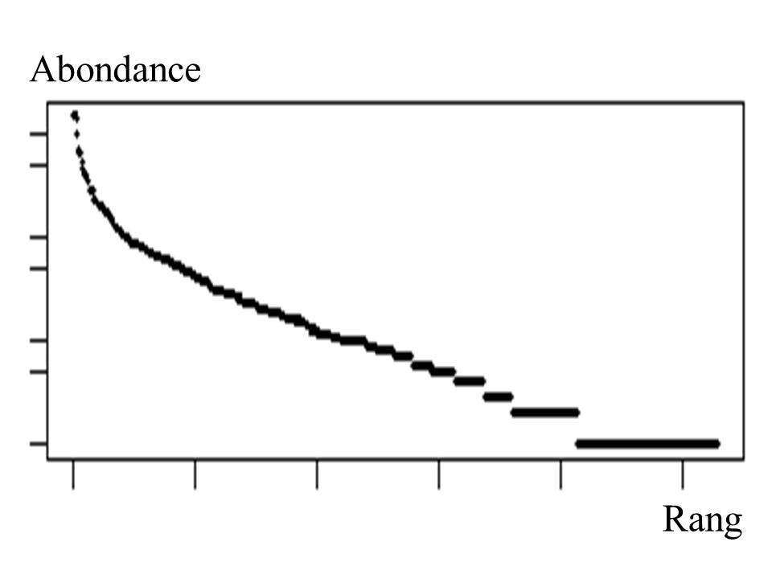

---
output:
  pdf_document: default
  html_document: default
---
# Introduction générale

Les forêts couvrent 30% de la surface terrestre et assurent de nombreux biens et services environnementaux, économiques et sociaux indispensables à l'équilibre planétaire.
Malgré leur importance les forêts sont aujourd'hui extrêmement menacées dans le contexte de changements globaux actuel.

## Les forêts tropicales, au coeur des enjeux actuels

Par "forêt" ou "ecosystème forestier" on entend les assemblages de plantes, animaux et microorganismes au sein de leur environnement définissant une unité fonctionnelle.
Les arbres sont les composants essentiels de ces écosystèmes forestiers [@FRA2000]. 
Les forêts sont les régions les moins anthropisées du globe et portent de forts enjeux de conservation en accueillant la diversité animale et végétale et les taux d'endémisme les plus importants du globe [@Myers2000; @Mittermeier2003].

A l'échelle locale, les forêts entretiennent les cycles de l'eau et des nutriments (azote, phosphore, etc), et régulent le climat et la fertilité des sols [@Malhi2008; @Isbell2017].
A l'échelle globale ce sont des éléments centraux dans la régulation des gaz à effet de serre (*GES*), en tant que puits de carbone de 1.1 ± 0.8 PgC.yr^–1^ qui compensent une partie des émissions de GES, mais également en tant que sources potentielles lorsque leur dégradation libère le carbone stocké dans leur biomasse [@Pan2011; @Roy2017].

Les forêts assurent directement la subsistance de 500 millions de personnes en tant que source de nourriture (par la chasse et la collecte de produits forestiers non ligneux comestibles), d'eau, de matériaux de construction, et d'énergie (par l'utilisation du bois de chauffage et de cuisson). 
Elles sont de plus indispensables au bien-être des populations et possèdent d'importantes dimensions culturelle, spirituelle et patrimoniale [@FRA2015; @Tilman2014].
Enfin, l'exploitation forestière correspond à de forts enjeux économiques: elle représente ~ 1% du PIB mondial, une part importante de l'emploi et reste l'une des principales sources d'énergie [@CBDdiversity2011; @FAO2014].

Indispensables et irremplaçables, les forêts sont néanmoins dégradées ou disparaissent à une vitesse croissante: entre 2013 et 2015 leur surface globale a diminué de 3% [@FAO2009].
Elles subissent de fortes pressions anthropiques allant des changements d’usage des terres via déboisement pour l'élevage ou l'agriculture, à l'exploitation du bois légale ou illégale, la chasse ou l'introduction d’espèces invasives.
Elles subissent également les changements climatiques globaux qui augmentent la fréquence des événements extrêmes tels que les sécheresses, les incendies, ou les inondations [@Pachauri2014].\newline

Dans ce contexte les forêts tropicales, représentant 19.6 million de km², sont les régions à la fois les plus menacées et celles aux enjeux les plus importants [@Barlow2018].
Les forêts tropciales accueillent la diversité biologique la plus élevée au monde et sont les plus grandes forêts n'ayant jamais connu de forte perturbation anthropique [@Gentry1988; @FAO2011].
Historiquement peu peuplées, ces régions connaissent cependant une croissance démographique moyenne de près de 1,4% par an qui s'accompagne d'un développement économique proportionnel [@Asner2009].
L'impact de ces pressions anthropiques est de plus exacerbé par le contexte économique de nombreuses zones tropicales, où les investissements, les politiques de conservation et les capacités de recherche et de développement sont moindres.
Les impacts de ces pressions locales s'ajoutent aux changements globaux et entraînent des modifications importantes des écosystèmes, allant souvent vers une dminution de la diversité biologique.
Ces changements correspondent à la disparition locales d'espèces qui peut entraîner des changements écosystémiques plus profonds selon le rôle des espèces dans la communautés. 
Ces disparitions, qui constituent l'érosion actuelle de la biodiversité, sont telles qu'elles ont déjà été qualifiées de "sixième extinction de l'ère moderne" [@Vitousek1997; @Cardinale2012].

Une prise de conscience globale de la situation globale a été entérinée par la conférence des nations unies sur l'environnement et le développement à Rio en 1992.
De nombreux engagements politiques ont été pris vis à vis de la surveillance et de la conservation de la biodiversité et de la préservation du fonctionnement des forêts mais les menaces persistent voire grandissent malgré tout [@Summit1992; @Schlaepfer2000; @Dirzo2003a; @Morales-Hidalgo2015].
Ces engagement doivent être maintenus et améliorés aujourd'hui.
Plusieurs approches ont été adoptées pour assurer la conservation de la biodiversité.
La première s'appuie sur la création d'aires protégées, de plus en plus étendues aujourd'hui, mais dont les surfaces demeurent insuffisantes pour pallier l'érosion globale de la biodiversité [@Sist2015]. 
La seconde approche propose d'intégrer à la gestion des écosystèmes les enjeux à la fois environnementaux, économiques et humains.
Cela se traduit par l'intégration des services écosystémiques comme enjeu de gestion grâce à leur valorisation économique, via la création de de systèmes de paiement, de programmes comme le REDD+ ou de divers labels [@Agrawal2011;@Barlow2018].
Cette approche se traduit également par la mise en place de modes de gestion fondés sur les interactions entre nature et société, via par exemple la gestion communautaire des forêts impliquant les populations locales [@Liu2015].

## Exploitation et conservation des forêts tropicales

Parmi les différentes approches de conservation des forêts tropicales, la seule désignation d'aires protégées ne suffit pas au maintien de leur incroyable biodiversité et leur fonctionnement complexe [@Sist2015].
L'exploitation forestière est aujourd'hui un élément central pour la conservation des forêts car elle assure à la fois des profits économiques et sociaux tout en préservant la biodiversité et le fonctionnement des écosystèmes.
L'exploitation sélective en particulier peut jouer un rôle majeur.

L'exploitation sélective est à l'exploitation de quelques espèces cibles dont les individus exploités sont désignés à l'avance.
Elle crée des trouées éparses dans la canopée et nécessite l'ouverture d'un réseau important de dessertes pouvant impacter la biodiversité des forêts.
L'exploitation sélective reste néanmoins bien moins préjudiciable au fonctionnement de l'écosystème que de nombreuses autres activités anthropiques.
Elle concerne environ 20% de la surface des forêts tropicales et représente 12% de la production mondiale de bois d'oeuvre [@Martin2015].
L'exploitation représente ainsi un potentiel important pour la préservation des forêts, mais peut également peut avoir des conséquences significatives et entraîner par exemple des changements de composition et de diversité des communautés, voire l'extinction locale d'espèces [@Gibson2011].
L'impact de l'exploitation sélective en forêt tropicale dépendra des pratiques de gestion.
ces pratiques sont définies principalement par le diamètre minimum de coupe et par le temps de récupération après exploitation [@Sist2015], et sont aujourd'hui essentiellement calibrées en vue de la reconstitution du stock de bois d'oeuvre.
Elles intègrent cependant de plus en plus des enjeux de conservation en visant le maintien de la production sans entraîner de préjudice à l'intégrité et la productivité des forêts, ni de dommages environnementaux ou sociaux [@ITTO2005].
La gestion durable des forêts, définie par l' ITTO (*International Tropical Timber Organization*), doit ainsi permettre la  restauration de la diversité en espèces et du fonctionnement de l'écosystème après exploitation.
Dans ce contexte, toute réflexion sur la durabilité et l'amélioration de la gestion sylvicole nécessite de bien connaître  l'impact de l'exploitation sur la diversité et la composition des forêts .

## Diversité et assemblage des communautés

Les arbres sont les éléments essentiels des écosystèmes forestiers.
Leur diversité reflète celle des autres groupes floristiques et faunistiques et détermine largement le fonctionnement des communautés [@Guitet2017].
Individuellement, chaque espèce a une valeur intrinsèque pour le patrimoine naturel global et en fonction de ses caractéristiques biologiques peut avoir un rôle clé dans la communauté, comme c'est la cas pour les espèces *clé de voûte* [@Jones1994; @Power1996; @Gardner2007].
A l'échelle de la communauté, les processus et la productivité de l'écosystème dépendent des interactions entre individus et avec l'environnement et donc de leur diversité et de leur composition en espèces [@Begon2006].
La diversité détermine égalment la stabilité et la résilience des communautés en atténuant l'impact des maladies, des espèces invasives et des variations environnementales [@Elmqvist2003].
Toute perturbation ou changement susceptible de modifier la biodiversité et la composition des comunautés impacte donc le fonctionnement des écosystèmes, mais le détail de ces impacts et de leurs conséquences reste mal connu.

### Succession, mortalité et recrutement: supports de la trajectoire des communautés

Une perturbation correspond à des changements de l'environnement biotique (interactions entre individus) et abiotique (ensoleillement, flux d'eau, de nutriments et de matière) des communautés.
La réponse des communautés aux perturbations a été décrite comme une succession temporelle de processus écologiques consécutifs à ces changements environnementaux [@Clements1916].
Les modèles de succession identifiés correspondent dans un premier temps au recrutement d'espèces pionnières, meilleures acquisitrices des ressources rendues disponibles après perturbation.
Dans un deuxième temps avec la croissance des premiers recrutés la disponibilité en ressources diminue et la compétition augmente, excluant du recrutement les espèces les moins compétitrices. 
Les pionnières tout d'abord recrutées, sénescentes ou exclues par la compétition, sont petit à petit remplacées par les espèces de succession tardive qui correspondent en forêt tropicale à des espèces de croissance lente mais à longue durée de vie.
Ces combinaisons successives de processus démographiques de mortalité (disparition), et de recrutement (apparition) d'espèces dans la communauté restaure ainsi de façon déterministe une communauté typique de succession tardive  [@Denslow2000].

Le recrutement est ainsi un élément clé de la réponse des communautés aux perturbations. 
il regroupe l'ensemble des processus de production, de dissémination et de germination des graines, puis de survie et de croissance des plantules jusqu'à un seuil de recrutement.
Ce seuil est un diamètre minimum, représentatif de la taille et de la biomasse de l'arbre, à partir duquel l'individu est intégré aux inventaires car considéré comme assez développé pour participer significativement au fonctionnement de l'écosystème.
Les processus écologiques qui régulent le recrutement des espèce sont donc des déterminants majeurs de la réponse des communautés aux perturbations [@Denslow1980; @Schnitzer2001; @Asner2004].

```{r AssemblyRules, fig.align ='center',out.width='100%', fig.cap="Schéma des processus déterminant la réponse des communautés végétales aux perturbations. Les processus déterministes (partie haute) sélectionnent les espèces recrutées dans la communauté selon leurs préférences environnementales e leur compétitivité, tandis que les processus stochastiques (partie basse) reviennent à une sélection aléatoire."}
knitr::include_graphics("ExternalFig/Fig_AssemblyRules.jpg")
```

### Les règles d'assemblage des communautés

En plus d'expliciter la réponse des communautés aux perturbations il est primoridial d'en comprendre les processus sous-jacents.
Plusieurs hypothèses quant aux processus d'assemblage des communautés sont débattues aujourd'hui, notamment vis à vis de l'importance des processus stochastiques et déterministes.
Les processus déterministes sélectionnent les espèces de la communauté sur la base de leurs caractéristiques biologiques, en fonction de leurs performance dans l'environnement biotique et abiotique [@Molino2001].
Les processus stochastiques, qui relèvent de la théorie neutre, supposent un assemblage aléatoire de sespèces dépendant uniquement de l'histoire de la communauté et des limitations physique de dispersion ou de croissance (barrière à la dispersion, ordre d'arrivée des espèces) \@ref(fig:AssemblyRules) [@Hubbell2001].


Le débat quant au rôle respectif des processus stochastiques et déterministes est matérialisé dans le cas des forêts tropicales par la controverse sur la théorie des perturbations intermédiaires (*Intermediaite Disturbance Hypothesis*, *IDH* en anglais).
Cette théorie suppose la prépondérance de processus déterministes d'exclusion compétitive des espèces.
Elle prédit alors une diversité maximale pour des régimes de perturbation réguliers et d'intensité moyenne évitant la dominance de quelques espèces [@Molino2001].
Un tel régime de perturbations intermédaires correspond en effet à des conditions environnementales variables permettrait à un large panel d'espèces de s'installer ou de s'imposer lorsque les conditions environnementales leur deviennent favorables en comparaison du reste de la communauté.
Au delà d'un seuil d'intensité de perturbation en revanche les processus de sélection excluent plus d'espèces qu'ils n'en favorisent et la diversité des communautés diminue [@Chesson2000;@Kariuki2006a;@Berry2008a].

A l'inverse la théorie neutre suppose que les espèces sont équivalentes et que leur abondance ne dépend pas de leurs caractéritiques biologiques.
L'abondance des espèces dépendrait alors de processus aléatoires de dispersion, de croissance et de survie résultant en un assemblage stochastique des communautés [@Hubbell2001].

Bien que débattues les hypothèses déterministe et stochastique ne sont pas incompatibles et peuvent prédire la structure des communautés à différentes échelles et pour différents niveaux de richesse.
Il est vraisemblable que les règles d'assemblage des communautés soient une combinaison variable de processus déterministes et stochastiques, et la question se pose alors des facteurs qui déterminent ces combinaisons [@Chave2004]. 

## Comment mesurer la diversité biologique ?

Les processus démographiques et les règles d'assemblage d'espèces déterminent la structure, la composition et la diversité des communautés.
Prédire et gérer l'avenir des forêts et en particularité de leur précieuse diversité biologique nécessite de comprendre le rôle des ces différents processus dans la définission de la diversité biologique dans tous ses aspects.
La biodiversité est définie de l'échelle du gène à celle de l'écosystème considère la diversité des plantes, animaux, champignons et microorganismes qui constituent les écosystèmes, de leur variabilité génétique et phénotypique, et de la variabilité de leurs assemblages [@Loreau2005].
La biodiversité est souvent réduite à celle de richesse en espèces, mais tient compte en réalité des multiples aspects de richesse, d'homogenéité, de disparité et d'interactions entre les éléments du vivant qui constituent les communautés.
Appréhender les différents aspects de la biodiversité permet d'identifier les mécanismes écologiques fondamentaux qui régissent les écosystèmes et leurs dynamiques spatiales et temporelles [@Purvis2000; @Loreau2005].

### Composition et dissimilarité entre communautés

De nombreuses mesures permettent d'estimer ce turnover, qui prennent en compte ou non l'abondance des espèces [@Podani2013].
Nous avons choisis ici de mesurer le taux de remplacement d'abondance, ou similarité de Bray-Curtis, qui représente dans quelle mesure une communauté est le sous-ensemble d'une plus grande. 
En pratique, si la communauté recrutée après exploitation répond aux mêmes lois que la communauté initiale elle sera équivalente à une communauté qui en aurait été tirée au hasard. La similarité de Bray-Curtis mesure la somme des abondances d'une commaunté remplacées par une espèce différente, normalisée par l'abondance totale partagée entre les deux communautés \@ref(eq:formNestedness).

\begin{equation}
T_{ab}=\frac{\sum_{i=1}^{n}|x_i^a - x_i^b| - \bigg| \sum_{i=1}^{n}{x_i^a} - \sum_{i=1}^{n}{x_i^b} \bigg|}{\sum_{i=1}^{n}\max{\left( x_i^a;x_i^b \right)}}
(\#eq:formNestedness)
\end{equation}


### Assemblage et structure des communautés {#AbundanceDistribution}

Une communauté, qu'elle soit végétale, animale ou microbienne, est constituée d'espèces aux effectifs différents: certaines sont très abondantes, d'autres moyennement communes et d'autres encore, souvent la majorité, sont rares.
La façon la plus simple et immédiate de décrire une communauté est de donner la distribution d'abondance de ses espèces, qui représente les proportions d'espèces abondantes rapport aux espèces communes ou rares.
Cette distribution bien que variable d'une communauté à l'autre, est régie par des lois écologiques lui donnant invariablement une courbe en creux \@ref(fig:AbdDist) [@McGill2007].

```{r AbdDist, fig.align ='center',out.width='60%', fig.cap="Exemple de distribution d'abondance pour une communauté d'arbres en forêt tropicale humide"}

```

Cette uniformité des distributions d'abondance a motivé le développement de modèles proposant des relations mathématiques entre le nombre d'espèces et leur abondance.
Ces modèles reflètent le lien entre l'importance d'une espèce dans la communauté et la quantité de ressources qu'elle mobilise pour son développement: plus une espèce est compétitive, plus elle sera abondante.
Ce lien s'établit vis à vis de la ressource limitante, qui peut être la lumière, l'eau disponible, les nutriments du sol, l'espace, etc [@Silvertown2004;@terSteege2006]. 
Prédire une distribution d'abondance revient à prédire la répartition de la ressource limitante entre les espèces de la communauté.
De nombreux modèles prédictifs ont été proposés, des modèles statistiques divisant aléatoirement la ressource selon une loi de propabilité donnant les effectifs de chaque espèce, aux modèles mécanistes divisant la resource selon une formule prédéterminée, par exemple en la divisant successivement selon une fraction constante [@Fisher1943; @Motomura1932; @Tokeshi1993; @Magurran1988].

Ces modèles testés pour de nombreuses communautés, ont démontré pouvoir représenter correctement les communautés réelles et révéler les règles écologiques qui en régissent l'assemblage.
Ce sont des outils adéquats pour comparer les communautés et en interpréter les différences, mais manipuler une distribution d'abondance reste compliqué car il s'agit d'une repréentation en 2D et ne permet pas de quantifier les différences entre communautés.
En revanche, les paramètres de ces distributions et des modèle proposés pour les représenter permettent de quantifier le nombre d'espèces, la forme des distribution, ou encore l'homogénéité des abondances.
Ces indicateurs sont les indices de diversité, résumant de façon quantifiable les caractéristiques des distributions d'abondance.

### Les composantes de la diversité

Si la biodiversité d'une communauté est souvent assimilée à sa richesse en espèces, elle englobe en réalité le nombre, l'abondance, la composition et les interactions entre les espèces.
L'abondance en particulier est essentielle: une espèce dominante n'apportera pas la même contribution à l'écosystème qu'une espèce rare.
Ainsi une communauté dominée par une ou deux espèces très abondantes sera intuitivement moins diverse qu'une autre avec autant d'espèces mais aux abondances équivalentes.
L'homogeneité des abondances dans une population, ou *équitabilité*, peut être bien plus révélatrice du fonctionnement des écosystèmes que leur richesse ou leur composition.
Cette idée est illustrée par l'hypothèse du ratio de biomasse selon laquelle les espèces dominantes sont bien plus déterminantes du fonctionnement des écosystèmes que les espèces rares.
Les espèces peu communes n'ont une influence qu'à long terme, en tant que potentielles futures espèces dominantes si l'environnement change, ou pas d'influence si elles sont transitoires et ne persistent pas dans l'écosystème [@Grime1998].

La richesse, simplement le nombre d'espèces recensées, et l'équitabilité, la régularité de distribution d'abondance des espèces, sont donc les deux composantes de la diversité taxonomique d'une communauté \@ref(fig:RichEqu) [@Whittaker1965; @Magurran2004].

```{r RichEqu, fig.align='center',out.width='60%', fig.cap="Les deux composantes de la diversité taxonomique: richesse (nombre d'espèces) et équitabilité (homogeneité de répartition)"}
knitr::include_graphics("ExternalFig/Fig_RichnessEquitability.jpg")
```

Mesurer la diversité ne revient donc pas à une mesure unique mais plusieurs indices de diversité qui combinent différemment les composantes de la diversité.
Plusieurs familles d'indices de diversité ont été développées et regroupent les indices mesurés selon une même formule dont les déclinaisons accordent un poids variables aux composantes de la diversité.
La famille des indices de diversité de Réyni par exemple, judicieuse pour l'étude des communautés végétales, rassemble les indices mesurés selon l'équation \@ref(eq:formHCDT) modulée par un paramètre *q* appelé "ordre de diversité" qui correspond au poids des espèces rares par rapport aux espèces abondantes [@Mendes2008].
Plus l'ordre de diversité est élevé, plus les espèces rares sont négligées par rapport aux espèces abondantes.

\begin{equation}
{^{q}H=\frac{1}{q-1}\Bigg(1-\displaystyle\sum_{s=1}^{S}p^q_s\Bigg) }
(\#eq:formHCDT)
\end{equation}

Dans cette famille d'indices de diversité se retrouvent les indices les plus utilisés dans la littérature: l'ordre 0 où chaque espèce contribue de la même façon correspond à la richesse spécifique, l'ordre 1 où richesse et équitabilité sont également prises en compte correspond à l'indice de Shannon, et l'ordre 2 pour lequel les espèces rares sont presque négligées correspond à l'indice de Simpson (parfois appelé "diversité en espèces abondantes") [@Shannon1948; @Simpson1949; @Patil1982; @Tothmeresz1995].

Ces indices, mathématiquement corrects et représentatifs des différentes composantes de la diversité, ne donnent cependant pas un nombre intelligible qui permettent de comparer facilement différentes communautés.
Les indices de diversité doivent être traduits en *nombre équivalent d'espèces* qui correspond au nombre d'espèces qu'aurait la communauté étudiée si toutes les espèces avaient la même abondance.
Ce nombre équivalent d'espèces, ou *nombre de Hill*, est obtenu par transformation des valeurs obtenues par une exponentielle à base q [@Hill1973].

Les mesures de diversité choisies sont donc la traduction intelligible en nombre équivalent d'espèces d'une déclinaison d'indices combinant richesse et équitabilité de différentes façons pour capter toute structure de diversité.

### Résolution du biais d'échantillonnage

En pratique aucun inventaire n'est exhaustif et l'étude de la diversité se heurte aux biais d'échantillonnage qui sous-estiment la richesse et faussent l'abondance des espèces.
Corriger ce biais nécessite d'estimer les abondances réelles à partir des observations et des relations mathématiques reliant les abondances des différentes espèces.
La première méthode développée correspond à la formule des fréquences de Turing [@Good1953] où l'abondance réelle *\alpha_v* d'une espèce observée *v* fois dans un échantillonnage de *n* individus dépend du nombre d'espèces observées également *v* fois et d'e celles'espèces observées *v+1* fois \@ref{eq=formGoodTuring}:

\begin{equation}
\alpha_v=\frac{\big(v+1\big)}{n}\frac{s^n_{v+1}}{s^n_v}
(\#eq:formGoodTuring)
\end{equation}

Les singletons (espèces observées une seule fois) et les doubletons (espèces observées deux fois) sont alors particulièrement intéressants car il permettent d'estimer le nombre *s^n_0* d'espèces observées zéro fois ($s^n_0=\frac{s^n_1}{n}$) qui ont été manquées dans l'inventaire et peuvent être ajoutées aux observation pour corriger le biais d'échantillonnage de la richesse.

De nombreuses méthodes ont repris cette relation en y intégrant notamment la notion de *taux de couverture* qui quantifie l'effort d'échantillonnage d'un inventaire réel et permet de savoir quelle proportion de la communauté est échantillonnée [@Dauby2012].
La correction la plus adéquate a pu être déterminée selon le taux de couverture de l'inventaire et les estimateurs de la diversité sont aujourd'hui très fiables [@Chao2015; @Marcon2015b].

### Diversité fonctionnelle

Les mesures de diversité décrites précédemment, appelées diversité neutre, considèrent toutes les espèces de la même façon que celles-ci aient ou non des caractéristiques biologiques ou phylogénétiques proches. 
Ces diversités peuvent cependant facilement intégrer les caractéristiques des espèces en mesurant leur similarité et une communauté sera d'autant plus diverse que les espèces qui la constituent sont différentes.
Pour des communautés végétales la diversité phylogénétique considère les distances entre espèces dans un arbre phylogénétique et la diversité fonctionnelle considère leurs différences morphologiques ou physiologiques \@ref(fig:RichEquSim).

```{r RichEquSim, out.width='60%', fig.cap="Troisième composante de la diversité: la similarité entre espèces basée sur des distances phylogénétiques ou taxonomiques"}
knitr::include_graphics("ExternalFig/Fig_RichnessEquitabilitySimilarity.jpg")
```

Ces similarités sont ensuite intégrées aux indices de diversité, au même titre que la richesse et l'équitabilité, sous la forme d'une matrice de distances entre espèces calculée sur la base de leur phylogénie ou de leurs traits fonctionnels.

Les traits fonctionnels sont les caractéristiques morphologiques, physiologiques et phénologiques des espèces, ils déterminent le fonctionnement des individus, leur performance de croissance et de survie, et leurs interaction avec l'environnement [@Violle2007b].
L'approche fonctionnelle décrivant les espèces et les individus selon leurs caractéristiques biologiques a été largement adoptée en écologie.
D'une part, cette approche réduit la dimensionnalité des communautés, indispensable pour l'étude d'écosystèmes aussi riches que les forêts tropicales et permet de comparer les communautés quelle que soit leur composition en espèces [@Begon2006; @Scheiter2013; @Mouillot2013a; @Sakschewski2016].
D'autre part, composition et diversité fonctionnelle sont interprétables en termes d'utilisation des ressources et de flux de matière et d'énergie, et relient directement la diversité des communautés à leur fonctionnement.
Enfin, cette approche appréhende la signature fonctionnelle des perturbations et permet d'identifier et de quantifier les processus déterminant la dynamique des communautés [@Funk2017].
La définition des processus déterministes est qu'ils n'impliquent pas les espèces de la même façon selon leurs caractéristiques biologiques: l'exclusion abiotique d'espèces non adaptées à l'environnement se traduiront par une aggrégation de la communauté dans l'espace des traits fonctionnels et une diminution de sa diversité fonctionnelle, tandis que l'exclusion compétitive limitant les similarité entre espèces se traduira par une dispersion des traits fonctionnels de la communauté et une diversité fonctionnelle élevée [@McGill2006;@Kunstler2012].

L'approche fonctionnelle nécessite de choisir judicieusement les traits intégrés aux indices de diversité.
Une vaste littérature a permis d'identifier les traits clés représentatifs de l'écologie et de la croissance des espèces et de leur influence sur le fonctionnement de l'écosystème [@Reich2014].
Les traits foliaires tout d'abord, qui déterminent la stratégie d'acquisition et d'allocation des resources lumineuses, définissent un "spectre économique foliaire" qui oppose les espèces à larges feuilles fines ayant une forte capacité photosynthétique permettant une acquisition rapide des resources, aux espèces à petites feuilles coriaces et résistantes.
Un gradient similaire s'applique aux traits racinaires et aux propriétés du bois, opposant les espèces aux tissus légers à courte durée de vie permettant une croissance rapide à celles aux tissus denses plus résistants et mobilisant plus de ressources [@Chave2009; @Valverde-Barrantes2017].
Les stratégies d'acquisition des resources déterminent la stratégie de croissance des espèces: les espèces "acquisitives" auront une croissance rapide et une courte durée de vie tandis que les espèces "conservatives" auront une croissance plus lente mais une meilleure résistance aux conditions environnementales éprouvantes [@Reich1997; @Wright2004].
A ces traits fonctionnels mesurables à l'échelle de l'individus s'ajoutent des *traits d'histoire de vie* mesurables à l'échelle de l'espèce.
Parmi ces traits la masse des graines et la hauteur moyenne maximale des arbres à l'âge adulte ont montré être particulièrement représentatifs des stratégies de croissance, de survie et de reproduction [@Westoby1998; @Herault2011].
La combinaison de l'ensemble de ces traits spécifique, foliaires, racinaires et du bois appréhende la stratégie fonctionnelle des espèces, leurs préférences écologiques et leur performance de croissance et de survie.
L'engouement récent de l'écologie pour l'approche fonctionnelle a de plus permis la création de bases de données fonctionnelles conséquentes et standardisées qui rendent possibles l'approche fonctionnelle à l'échelle des communautés [@Kattge2011; @Perez-Harguindeguy2013; [^1]]

[^1]: http://www.ecofog.gf/Bridge/

L'approche fonctionnelle considère la diversité des communautés mais également leur composition fonctionnelle mesurable par les valeurs moyennes de traits pondérées par l'abondance des espèces (*Community Weighted Means, CWM* en anglais).
L'abondance des caractéristiques fonctionnelles détermine à la fois le fonctionnement des communautés et leur résilience.
D'après la théorie du "ratio de biomasse" [@Grime1998], le rôle d'un individu dans l'écosystème dépend de la fraction de biomasse qu'il représente et le fonctionnement des communautés repose sur les espèces dominantes tandis que les espèces rares ont peu d'influence.

Par ailleurs la répartition d'abondance des traits fonctionnels amène à la notion de redondance fonctionnelle qui quantifie le nombre d'espèces partageant les mêmes valeurs de traits.
La redondance fonctionnelle, souvent élevée en forêt tropicale, permet aux communautés de perdre des espèces sans nécessairement voir disparaître leur rôle dans l'écosystème: la redondance détermine en partie la résilience des communautés et atténue l'impact des perturbations.
L'organisation de la redondance dans l'espace des traits d'une communauté renseigne sur les assemblages les plus stables qui se dégageraient le plus probablement après de nouvelles perturbations.
La redondance fonctionnelle d'une communauté peut se mesurer dans l'espace fonctionnel à partir de la densité de probabilité de traits (*Traits Density Probability, TDP* en anglais) de chaque espèce [@Carmona2016].
Les densités des espèces d'une communauté pondérées par leur abondance sont additionnées pour donner la redondance fonctionnelle sur l'ensemble de l'espace fonctionnel ou sur un espace restreint, comme nous le ferons par la suite quand on s'intéressera à la redondance fonctionnelle dans l'espace de la communauté de départ \@ref(fig:RedundancyMethod).

```{r RedundancyMethod, fig.cap="La redondance fonctionnelle est la somme des chevauchement entre espèces dans l'espace fonctionnel. Les individus de la base de données fonctionnelle sont représentés dans un espace à 2 dimensions grâce à une analyse en composantes principales (ACP). Une estimation par noyau estime ensuite la densité de probabilité des traits (TDP) de chaque espèce. La somme de ces densités pondérées par l'abondance des espèces donne enfin la redondance fonctionnelle de la communauté, interprétable comme le nombre d'espèces qui peuvent disparaître sans diminuer l'espace fonctionnel de la communauté."}
knitr::include_graphics("ExternalFig/Fig_MesureRedondance.jpg")
```


## La Guyane Française et l'exemple de la station de Paracou

Le bassin Amazonien est la plus riche des trois principales régions de forêt tropicale humide [@Gentry1988] et la Guyane française en est une région de 83 846 km^2^ recouverte à 95% forestière au Nord-Est du continent sud-américain entre le Surinam et le Brésil.

### Le contexte Guyanais

La région appartient au bouclier des Guyanes qui s'étend de l'Amapa au Brésil jusqu'au delta de l'Orénoque au Venezuela.
Formé il y a plus de 2 milliards d'années, le bouclier des Guyanes est un assemblage d'unités géomorphologiques façonnées par une succession d'épisodes géologiques, climatiques et marins.
Ces unités correspondent à des conditions pédologiques, climatiques et topographiques déterminant la composition et la diversité du couvert végétal et les processus écologiques qui les régissent, tels que les migrations et le filtrage environnemental [@Guitet2015].

Le relief Guyanais est une grande diversité topographique qui alterne entre des collines allant jusqu'à 50m d'altitude, et des bas-fonds humides.
Les sols sont des Acrisols recouvrant une couche de saprolite transformée peu perméable qui entraîne un drainage latéral des précipitations.
La profondeur des sols, leur composition et leur capacité de rétention et de drainage de l'eau sont très hétérogènes [@Ferry2010; @Robert2003].

Le climat est un climat tropical humide, davantage marqué par le régime des précipitations que par celui des températures. 
La température moyenne est 26°C et reste constante au cours de l'année tandis les précipitations moyennes annuelles varient de 2 000 à 4 000 mm.an^-1^ et montrent une grande variabilité spatiale et temporelle.
Les précitations suivent un gradient décroissant marqué d'est en ouest et une forte variabilité au cours de l'année, avec une saison humide entre novembre et avril et une saison sèche d'avril à mi-juillet durant laquelle les précipitations sont inférieures à 50 mm [@Wagner2011].

La forêt Guyanaise est une forêt équatoriale sempervirente ombrophile de plaine. 
D'une richesse incroyable, elle accueille plus de 7 000 espèces végétales (hors champignons) dont 1 500 espèces d'arbres et une richesse faunistique toute aussi incroyable [@DeNoter2008].
La composition taxonomique des arbres est très variable sur le territoire.
Plusieurs patrons de composition on été mis en évidence selon un gradient du nord-ouest où dominent les familles botaniques des *Lecythidaceae* et *Cesalpinaceae*, au sud-est où dominent *Burseraceae* et *Mimosaceae*.
Ces patrons suivent en particulier par une combinaison de gradients topographique et pédologique [@Sabatier1989; @Sabatier1997 cf Toto; @Guitet2015].

### Paracou, plus de 30 de suivi de la forêt Amazonienne

Le dispositif de Paracou, installé entre les communes de Kourou et Sinnamary (5°18'N and 52°53'W), a été mis en place en 1984 pour étudier l'impact de l'exploitation forestière sélective sur les peuplements forestiers.
Le dispositif correspond à l'origine à 12 parcelles de 6.25 ha ayant subi en 1984 un gradient de trois intensités d'abattage, d'éclairices et de coupe de bois de chauffage.
Le traitement de perturbation a été attribué selon un dispositif aléatoire de trois réplications de 4 traitements: parcelles témoins sans intervention (*T0*), traitement 1 avec coupes d'abattage (*T1*), traitement 2 avec abattage et éclaircies par annélation (*T2*), traitement 3 avec abattage, éclaircies et coupe de bois de chauffage (*T3*) \@ref(tab:InterventionTable).

En 1990, trois parcelles de 6.25ha et une parcelle de 25ha (parcelles 13, 14, 15 et 16) ont été ajoutées au dispositif pour l'étude et le suivi de la diversité en forêt non perturbée \@ref(fig:ParacouDesign).

```{r ParacouDesign, out.width='60%', fig.cap="Dispositif expérimental de Paracou, schéma des 16 parcelles de suivi des dynamiques forestières. La couleur des parcelles indique l'intensité de perturbation appliquée à 9 des parcelles en 1984 (voir le tableau 1."}
knitr::include_graphics("ExternalFig/Paracou.jpg")
```

Sur l'ensemble du dispositif sont recensées 591 espèces d'arbres appartenant à 223 genre et 64 familles botaniques, principalement les *Fabaceae*, les *Chrisobalanaceae*, les *Lecythidaceae* et les *Sapotaceae*.
Les températures annuelles atteignent 26°C et les précipitations 2 980 mm.an^-1^ de mi-août à mi-novembre, avec une saison sèche d'un mois en mars [@Wagner2011].

### Méthodes d'inventaires

Depuis la mise en place du dispositif en 1984 toutes les parcelles sont inventoriées chaque année à la saison sèche à partir de mi-juillet.
Tous les arbres de plus de 10 cm de diamètre à 1.30 m (diamètre à hauteur de poitrine, *DBH* en anglais) sont identifiés, numérotés et cartographiés.
Les arbres morts sont relevés chaque année et notés en précisant le type mort (mort sur pied, chablis primaire ou chablis secondaire).

Lorsqu'un arbre atteint 10 cm il est *recruté* et sera mesuré chaque année.
Il est identifié dans un premier temps par un nom *vernaculaire*, ou nom commun, attribué par l'équipe de terrain.
En 1984, 62 espèces commerciales étaient identifiées par un nom commun propre tandis que toutes les autres espèces étaient regroupées sous deux noms vernaculaires distinguant les palmiers des espèces arborées.
Cette identification en nom vernaculaire s'est précisée par la suite et aujourd'hui 235 noms vernaculaires différents sont recensés pour l'ensemble du dispositif sur les 30 ans de suivi.
Des campagnes d'identification botanique au cours desquelles les arbres sont identifiés au niveau espèce botanique ont été mises en place à partir de 2003 et se poursuivent depuis tous les 5 à 6 ans.

L'histoire des inventaires botaniques s'étant construite petit à petit au gré des nouveaux projets et des forces en présence, la précision et le taux d'identification botaniques sont variables au cours du temps et entre les parcelles.
Ceci génère des incertitudes taxonomiques importantes, les noms vernaculaires correspondant souvent à plusieurs noms botaniques et inversement [@Oldeman1968].
Le soucis vient alors des arbres n'ayant qu'un identification en nom vernaculair, lorsque l'individu est mort avant d'avoir pu être identifié au cours d'une campagne botanique par exemple.

## Problématique et plan de la thèse

La thèse présentée ici cherche à déterminer les processus écologiques et la réponse taxonomique et fonctionnelle après perturbation d'une forêt tropicale naturelle et à expliciter sa résilience, en vue de discuter de son maintien dans le contexte actuel des changements globaux et de la possibilité d'une sylviculture durable.
Le document s'organise en trois chapitres correspondant à trois articles scientifiques en cours de soumisson.

* Le premier chapitre présente un estimateur de la diversité taxonomique et fonctionnelle des communautés tenant compte des incertitudes taxonomiques inhérentes aux inventaires forestiers. 
La méthode utilise l'association entre noms vernaculaires et noms botaniques pour reconstituer itérativement des inventaires complets théoriques à partir desquels sont estimés moyenne et l'intervalle de sûreté de la diversité.
Dans un premier temps nous calibrons la méthode pour avoir l'estimation la plus précise possible en fonctoin des données disponibles. Dans un deuxième temps nous appliquons la méthode de propagation au cas des inventaires forestiers, qui couvrent de larges surfaces de temps et d'espace, pour les valoriser dans l'étude et la préservation des forêts tropicales.
Enfin nous appliquons cette méthode aux dispositifs expérimentaux, dont les contraintes d'incertitude sont différentes, et qui sera utilisée dans la suite de ce travail.

* Dans le deuxième chapitre nous avons étudié les trajectoires de composition et de diversité taxonomique et fonctionnelle des 75ha de Paracou suivis sur 30 ans.
Ces trajectoires permettent de clarifier la réponse aux perturbations de la composition et la diversité des communautés en forêts Néotropicale, d'identifier les processus écologiques sous-jacents, et de discuter de leur résilience.  
Nous examinons en particulier (i) la convergence des trajectoires taxonomiques et fonctionnelles et leur implication quant au maintien des différences entre communautés après perturbation, (ii) la validité théorie des perturbations intermédiaires, débattue en forêt tropicale et rarement testée sur le long terme, et (iii) la durée et aspects de la résilience des communautés.

* Dans le troisième chapitre nous étudions spécifiquement les trajectoies de recrutement. Nous testons en particulier (i) la déclinaison des modèles classique de succession forestière pour forêts tropicales, dont la validité est questionnée par l'immense diversité des communautés, et après une perturbation modérée, qui implique la maintient d'une communauté pre-perturbation significative, et (ii) questionnons la durée de restauration du fonctionnement de l'écosystème et les implications pour la gestion forestière.

`r if (knitr:::is_html_output()) '# References {-}'`

