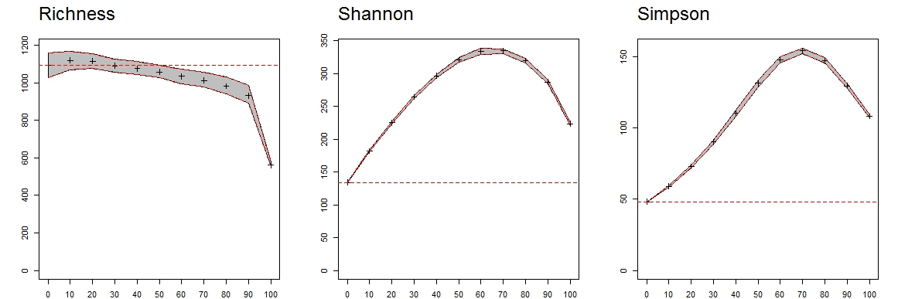

# Article 1 : Des inventaires forestiers aux trajectoires de diversité: le problème universel de l'incertitude

Malgré les enjeux liés aux forêts tropicales et l'urgence d'en préserver l'intégrité et le fonctionnement, seule une petite fraction de leur diversité est connue.
Le nombre d'espèces inventoriées sous les tropiques ne correspondant qu'à une observation unique [@Feeley2011] présume de l'ampleur de notre méconnaissance et rend impossible toute supposition sur la distribution des espèces et leurs dynamiques.
Il est essentiel d'améliorer notre connaissance du vivant, en fournissant un plus grand effort d'échantillonnage et en valorisant toute connaissance déjà disponible.

Le coût des inventaires en temps, en main d'oeuvre et en moyens, d'autant plus important que le niveau de l'inventaire est précis, implique de travailler également à des méthodes pour valoriser tout type d'inventaires [@Baraloto2012].
Dans le cas de l'étude des peuplements forestiers, les inventaires d'exploitation peu coûteux et couvrant des surfaces larges sont une source d'information incontournable [@terSteege2000;@Guitet2014].

## Noms vernaculaires et propagation des incertitudes taxonomiques

Ces inventaires ne sont cependant généralement pas réalisés en noms scientifiques mais noms vernaculaires, qui sont mieux connus, plus faciles à attribués car basés sur des critères morphologiques, culturels ou d'usage et qui ne nécessitent pas de vérification botanique ultérieure à partir d'herbiers.
Cette simplicité se fait cependant au détriment de la fiabilité des noms vernaculaires, qui correspondent à plusieurs espèces botaniques et varient avec le temps et les équipes de terrain [@Oldeman1968].
Pour valoriser ces inventaires il est donc nécessaire d'évaluer l'impact de l'incertitude taxonomique sur la fiabilité et la sensibilité des mesures de diversité.
Nous proposons ici une méthode permettant de propager l'incertitude de détermination taxonomique des noms vernaculaires aux mesures de la diversité.

Dans un premier temps nous appliquons cette méthode au contexte des inventaires d'exploitation en noms vernaculaires pour en estimer la fiabilité et la robustesse selon le degré d'indétermination botanique, et proposer un protocole d'inventaire standardisé.
Dans ce cas les identifications botaniques fiables concernent quelques espèces cibles, emblématiques ou ayant une certaine valeur commerciale ou de conservation.
Le degré d'indétermination botanique correspond alors au nombre d'espèces identifiées systématiquement par leur nom vernaculaire plutôt que botanique.
Dans un deuxième temps nous adaptons la méthode au contexte des dispositifs expérimentaux pour pallier l'inévitable variabilité des pratiques d'inventaires.
Dans ce cas les arbres identifiés uniquement par un nom vernaculaire sont les individus n'ayant pu être identifiés, que l'identification soit impossible ou qu'ils soient mort avant le passage du taxonomiste.
Le degré d'indétermination correspond au nombre d'arbres sans identification botanique et concerne potentiellement toutes les espèces de la communauté. 

## Article 1 _ Inescapable Taxonomists: Workable Biodiversity Management Must Base on a Minimum Field Work


## La recherche et les suivis à long terme: application de la méthode de propagation aux inventaires de Paracou

### Profils d'incertitude taxonomique

Sur le même principe que pour les inventaires d'exploitation, nous avons simulé un gradient d'indétermination taxonomique à partir d'inventaires en nom botanique complets pour évaluer pour en évaluer l'impact sur les mesures de diversité.
Dans le cas des dispositifs expérimentaux, les individus ayant uniquement par un nom vernaculaire sont des arbres tirés au hasard dans la communauté initiale qui n'ont pas pu être identifiés lors des campagnes botaniques\@ref(fig:SimuTrees).

```{r SimuTrees, out.width='60%', fig.cap="Profil de biais pour les diversité de Richesse, Shannon et Simpson le long d'un gradient d'indétermination de 0 à 100% des arbres identifiés par leur nom vernaculaire uniquement. Les profils de biais représentent la moyenne et les quantiles 0.025 et 0.975 de la distribution des diversités obtenues pour 100 simulations de tirage aléatoire et propagation des incertitudes."}

```

Le profil de biais obtenu montre un effet non négligeable du degré d'indétermination sur la mesure de la diversité.
En tirant les arbres indéterminés aléatoirement, on a plus de chances de classer les espèces abondantes en indéterminées, et de les réattribuer par la méthode de propagation à des espèces plus communes.
L'estimateur de la richesse est donc peu biaisé tant que le degré d'indétermination ne dépasse pas 80%, ce qui signifique que toutes les espèces ont au moins un représentant toujours identifié par son nom botanique.
En revanche les estimateur des diversité de Shannon et Simpson sont très rapidement biaisés positivement, ce qui signifie que l'équitabilité de la communauté est fortement surestimée par le processus de réattribution des espèces dominantes vers les espèces communes.
Les estimateurs s'ils sont biaisés sont en revanche peut variables et permettent de comparer plusieurs communautés, pourvu que leurs degrés d'indétermination soient similaires.

### Cas particulier de Paracou

L'histoire de détermination botanique des parcelles de Paracou implique une grande variabilité du degré d'indétermination au cours du temps et des différences significatives entres les parcelles.
Aujourd'hui tandis que les parcelles contrôle et du traitement 3 sont bien déterminées, moins de 5% des arbres 'ne sont identifiés que par un nom vernaculaire'ont pas d'identification botanique, d'autres parcelles du traitement 1 ou 2 sont encore mal déterminées et pour certaines plus de 30% des arbres n'ont pas d'identification botanique.

Jusqu'à présent le biais des estimateurs de diversité reste à resoudre, en revanche il est possible de pallier ces différences de détermination en considérant la compositon et la diversité des parcelles au niveau du genre plutôt qu'au niveau de l'espèce.

