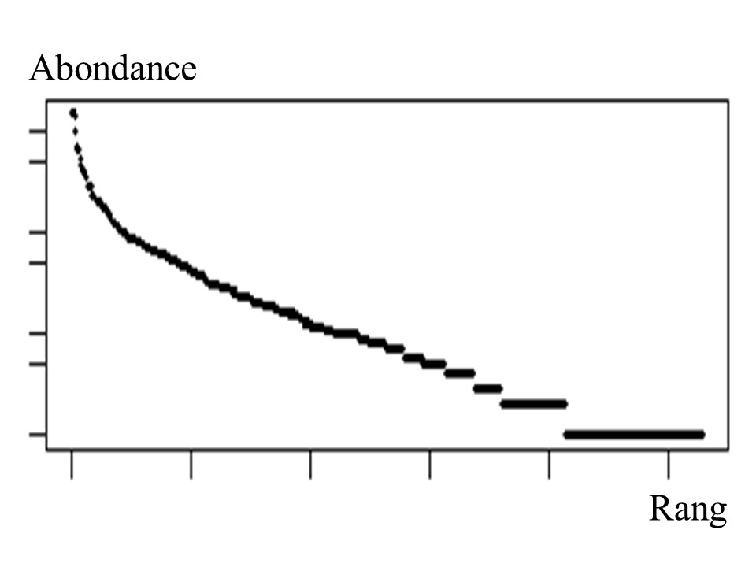
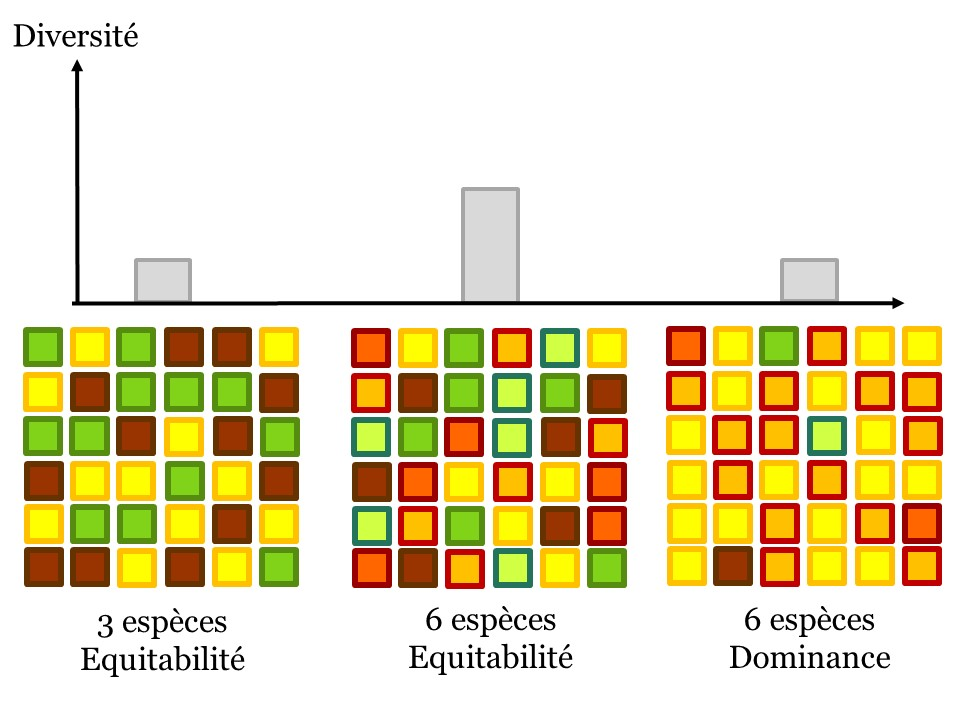
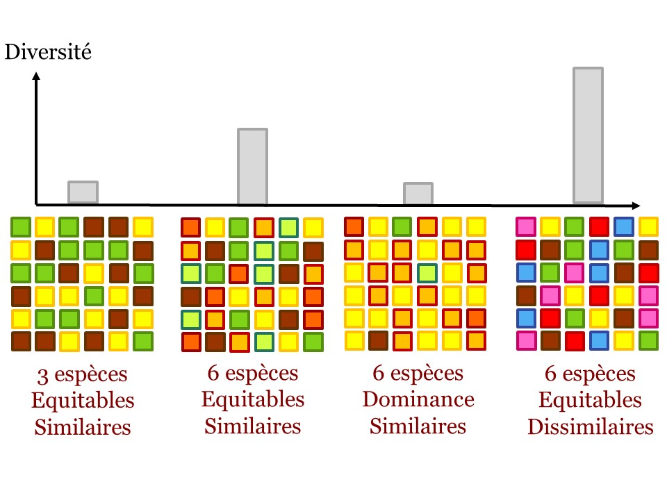
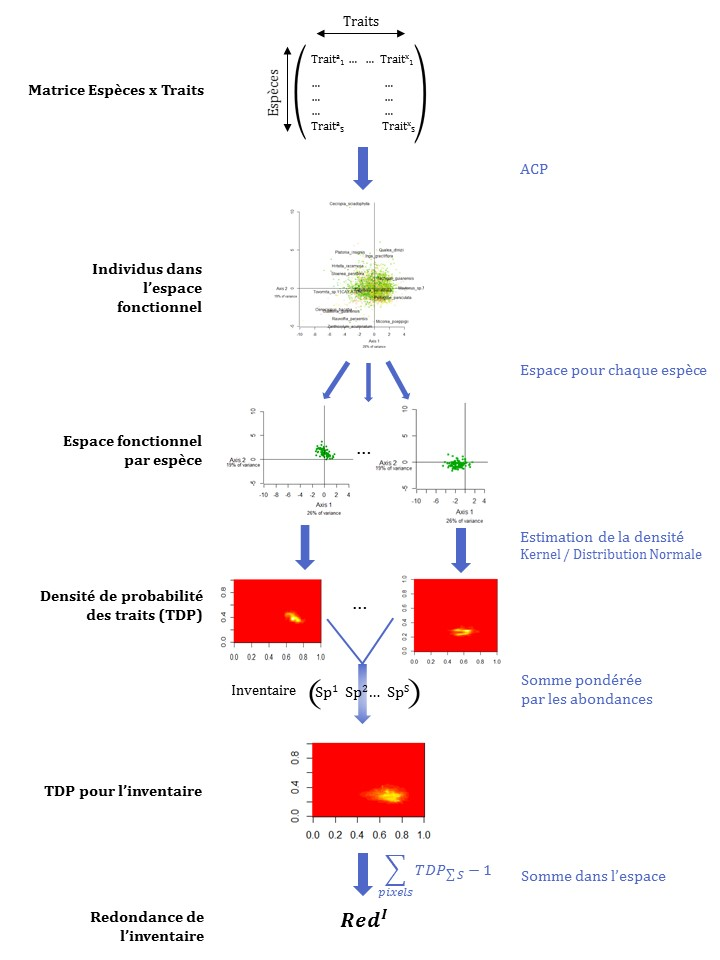

---
output:
  pdf_document: default
  html_document: default
---
# Introduction générale

Les forêts couvrent 30% de la surface terrestre et assurent de nombreux biens et services environnementaux, économiques et sociaux indispensables à l'équilibre planétaire.
Malgré leur importance les forêts sont aujourd'hui extrêmement menacées dans le contexte de changements globaux actuel.

## Les forêts tropicales, au cœur des enjeux actuels

Par "forêt" ou "écosystème forestier" on entend les assemblages de plantes, animaux et microorganismes au sein de leur environnement définissant une unité fonctionnelle.
Les arbres sont les composants essentiels de ces écosystèmes forestiers [@FRA2000]. 
Les forêts sont les régions les moins anthropisées du globe et portent de forts enjeux de conservation en accueillant la diversité animale et végétale et les taux d'endémisme les plus importants du globe [@Myers2000; @Mittermeier2003].

A l'échelle locale, les forêts entretiennent les cycles de l'eau et des nutriments (azote, phosphore, etc.), et régulent le climat et la fertilité des sols [@Malhi2008; @Isbell2017].
A l'échelle globale ce sont des éléments centraux dans la régulation des gaz à effet de serre (*GES*), en tant que puits de carbone de 1.1 ± 0.8 PgC.yr^–1^ qui compensent une partie des émissions de GES, mais également en tant que sources potentielles lorsque leur dégradation libère le carbone stocké dans leur biomasse [@Pan2011; @Roy2017].

Les forêts assurent directement la subsistance de 500 millions de personnes en tant que source de nourriture (par la chasse et la collecte de produits forestiers non ligneux comestibles), d'eau, de matériaux de construction, et d'énergie (par l'utilisation du bois de chauffage et de cuisson). 
Elles sont de plus indispensables au bien-être des populations et possèdent d'importantes dimensions culturelle, spirituelle et patrimoniale [@FRA2015; @Tilman2014].
Enfin, l'exploitation forestière correspond à de forts enjeux économiques: elle représente ~ 1% du PIB mondial, une part importante de l'emploi et reste l'une des principales sources d'énergie [@CBDdiversity2011; @FAO2014].

Indispensables et irremplaçables, les forêts sont néanmoins dégradées ou disparaissent à une vitesse croissante: entre 2013 et 2015 leur surface globale a diminué de 3% [@FAO2009].
Elles subissent de fortes pressions anthropiques allant des changements d’usage des terres via déboisement pour l'élevage ou l'agriculture, à l'exploitation du bois légale ou illégale, la chasse ou l'introduction d’espèces invasives.
Elles subissent également les changements climatiques globaux qui augmentent la fréquence des événements extrêmes tels que les sécheresses, les incendies, ou les inondations [@Pachauri2014].\newline

Dans ce contexte les forêts tropicales, représentant 19.6 millions de km², sont les régions à la fois les plus menacées et celles aux enjeux les plus importants [@Barlow2018].
Les forêts tropicales accueillent la diversité biologique la plus élevée au monde et sont les plus grandes forêts n'ayant jamais connu de forte perturbation anthropique [@Gentry1988; @FAO2011].
Historiquement peu peuplées, ces régions connaissent cependant une croissance démographique moyenne de près de 1,4% par an qui s'accompagne d'un développement économique proportionnel [@Asner2009].
L'impact de ces pressions anthropiques est de plus exacerbé par le contexte économique de nombreuses zones tropicales, où les investissements, les politiques de conservation et les capacités de recherche et de développement sont moindres.
Les impacts de ces pressions locales s'ajoutent aux changements globaux et entraînent des modifications importantes des écosystèmes, allant souvent vers une diminution de la diversité biologique.
Ces changements correspondent à la disparition locales d'espèces qui peut entraîner des changements écosystémiques plus profonds selon le rôle des espèces dans la communauté. 
Ces disparitions, qui constituent l'érosion actuelle de la biodiversité, sont telles qu'elles ont déjà été qualifiées de "sixième extinction de l'ère moderne" [@Vitousek1997; @Cardinale2012].

Une prise de conscience globale de la situation globale a été entérinée par la conférence des nations unies sur l'environnement et le développement à Rio en 1992.
De nombreux engagements politiques ont été pris vis à vis de la surveillance et de la conservation de la biodiversité et de la préservation du fonctionnement des forêts mais les menaces persistent voire grandissent malgré tout [@Summit1992; @Schlaepfer2000; @Dirzo2003a; @Morales-Hidalgo2015].
Ces engagements doivent être maintenus et améliorés aujourd'hui.
Plusieurs approches ont été adoptées pour assurer la conservation de la biodiversité.
La première s'appuie sur la création d'aires protégées, de plus en plus étendues aujourd'hui, mais dont les surfaces demeurent insuffisantes pour pallier l'érosion globale de la biodiversité [@Sist2015]. 
La seconde approche propose d'intégrer à la gestion des écosystèmes les enjeux à la fois environnementaux, économiques et humains.
Cela se traduit par l'intégration des services écosystémiques comme enjeu de gestion grâce à leur valorisation économique, via la création de de systèmes de paiement, de programmes comme le REDD+ ou de divers labels [@Agrawal2011;@Barlow2018].
Cette approche se traduit également par la mise en place de modes de gestion fondés sur les interactions entre nature et société, via par exemple la gestion communautaire des forêts impliquant les populations locales [@Liu2015].

## Exploitation et conservation des forêts tropicales

L'une des approches les plus intuitives et courantes pour la conservation des forêts tropicales est la désignation d'aires protégées exemptes de toute activité anthropique.
Cette approche seule ne suffit cependant pas pour maintenir l'incroyable biodiversité de ces forêts et leur fonctionnement complexe [@Sist2015].
Pour cela l'exploitation forestière joue aujourd'hui un rôle central en permettant à la fois le maintien du fonctionnement des forêts et un développement économique et social, sous réserve d'une gestion adéquate.

L'exploitation sélective est l'exploitation de quelques espèces cibles dont les individus exploités sont désignés à l'avance.
Elle concerne environ 20% de la surface des forêts tropicales et représente 12% de la production mondiale de bois d'œuvre [@Martin2015].
Cette exploitation crée des trouées éparses et nécessite l'ouverture d'un réseau important de dessertes modifiant la structure de la canopée.
L'exploitation sélective peut impacter le fonctionnement des communautés mais reste néanmoins bien moins préjudiciable que de nombreuses autres activités anthropiques.
Bien gérée, l'exploitation sélective représente un potentiel de conservation important car elle allie développement économique et préservation du fonctionnement des forêts, mais peut également peut avoir des impacts négatifs comme par exemple des changements de composition et de diversité, voire l'extinction locale d'espèces [@Gibson2011].
L'impact de l'exploitation sélective en forêt tropicale dépendra des pratiques de gestion.
Ces pratiques sont définies principalement par le diamètre minimum de coupe et par le temps de récupération après exploitation [@Sist2015], et sont aujourd'hui essentiellement calibrées en vue de la reconstitution du stock de bois d'œuvre.
Elles intègrent cependant de plus en plus des enjeux de conservation en visant le maintien de la production sans entraîner de préjudice à l'intégrité et la productivité des forêts, ni de dommages environnementaux ou sociaux [@ITTO2005].
La gestion durable des forêts, définie par l'ITTO (*International Tropical Timber Organization*), doit ainsi permettre la  restauration de la diversité en espèces et du fonctionnement de l'écosystème après exploitation.
Dans ce contexte, toute réflexion sur la durabilité et l'amélioration de la gestion sylvicole nécessite de bien connaître l'impact de l'exploitation sur la diversité et la composition des forêts .

## Diversité et assemblage des communautés

Comprendre et anticiper la réponse aux perturbations des forêts tropicales passe par l'étude des communautés d'arbres, qui en sont les éléments principaux, et en particulier par leur diversité et leur composition.
La diversité des communautés d'arbres reflète celle des autres groupes floristiques et faunistiques et détermine largement le fonctionnement des communautés [@Guitet2017].
Individuellement, chaque espèce a une valeur intrinsèque pour le patrimoine naturel global et en fonction de ses caractéristiques biologiques peut avoir un rôle clé dans la communauté, comme c'est la cas pour les espèces *clé de voûte* [@Jones1994; @Power1996; @Gardner2007].
A l'échelle de la communauté la diversité et la composition des communautés détermine les interactions entre individus et avec l'environnement, et déterminent don le fonctionnement et la productivité des écosystèmes [@Begon2006].
La diversité détermine également la stabilité et la résilience des communautés en atténuant l'impact des maladies, des espèces invasives et des variations environnementales [@Elmqvist2003].
Toute perturbation ou changement susceptible de modifier la biodiversité et la composition des communautés impacte donc le fonctionnement des écosystèmes, mais le détail de ces impacts et de leurs conséquences reste mal connu.

### Succession, mortalité et recrutement: supports de la trajectoire des communautés

Une perturbation correspond à des changements de l'environnement biotique (interactions entre individus) et abiotique (ensoleillement, flux d'eau, de nutriments et de matière).
La réponse des communautés aux perturbations a été décrite comme une succession temporelle de processus écologiques consécutifs à ces changements environnementaux [@Clements1916].
Les modèles de succession identifiés impliquent dans un premier temps le recrutement d'espèces pionnières, meilleures acquisitrices des ressources rendues disponibles après perturbation.
Dans un deuxième temps la croissance de ces premiers recrutés diminue la disponibilité en ressources et augmente la compétition, excluant du recrutement les espèces les moins compétitrices. 
Les pionnières recrutées en premier lieu deviennent alors sénescentes ou exclues par la compétition et sont petit à petit remplacées par les espèces de succession tardive qui correspondent en forêt tropicale à des espèces de croissance lente mais à longue durée de vie.

Ce modèle de succession correspond à différentes combinaisons de processus de mortalité (disparition) et de recrutement (apparition) d'espèces dans la communauté et restaure ainsi de façon déterministe une communauté typique de succession tardive [@Denslow2000].
Le recrutement est ainsi un élément clé de la réponse des communautés aux perturbations. 
Le recrutement regroupe l'ensemble des processus de production, de dissémination et de germination des graines, et de survie et de croissance des plantules jusqu'à un seuil de recrutement.
Ce seuil est un diamètre minimum représentatif de la taille et de la biomasse de l'arbre à partir duquel l'individu est considéré comme assez développé pour participer significativement au fonctionnement de l'écosystème et est intégré aux inventaires.
Les nombreux processus écologiques qui régulent les différentes étapes du recrutement sont donc des déterminants majeurs de la réponse des communautés aux perturbations [@Denslow1980; @Schnitzer2001; @Asner2004].

### Les règles d'assemblage des communautés

La réponse des communautés aux perturbations résulte d'un ensemble de processus d'assemblage et de maintien des espèces.
Plusieurs hypothèses quant à ces processus sont débattues aujourd'hui, notamment vis à vis de l'importance des processus stochastiques et déterministes.
Les processus déterministes sélectionnent les espèces de la communauté sur la base de leurs caractéristiques biologiques, en fonction de leur performance dans l'environnement biotique et abiotique [@Molino2001].
Les processus stochastiques, qui relèvent de la théorie neutre, supposent un assemblage aléatoire des espèces dépendant uniquement de l'histoire de la communauté et des limitations physique de dispersion ou de croissance (barrière à la dispersion, ordre d'arrivée des espèces) [@Hubbell2001].

Le débat quant au rôle respectif des processus stochastiques et déterministes est matérialisé par la controverse sur la théorie des perturbations intermédiaires (*Intermediaite Disturbance Hypothesis*, *IDH* en anglais).
Cette théorie suppose la prépondérance de processus déterministes d'exclusion compétitive et prédit une diversité maximale pour des régimes de perturbation réguliers et d'intensité moyenne évitant la dominance de quelques espèces [@Molino2001].
Un tel régime de perturbations intermédiaires permet en effet une variabilité des conditions environnementales qui permet à un large panel d'espèces de s'installer lorsque les conditions environnementales leur deviennent favorables, puis de persister dans la communauté.
Au-delà d'un seuil d'intensité de perturbation en revanche un trop grand nombre d'espèces sont exclues et les quelques espèces favorisées deviennent dominantes, si bien que la diversité diminue [@Chesson2000;@Kariuki2006a;@Berry2008a].

A l'inverse la théorie neutre suppose que les espèces sont équivalentes et que leur abondance ne dépend pas de leurs caractéristiques biologiques.
Les espèces favorisées suite aux perturbations seraient alors variables, l'abondance des espèces dépendrait uniquement de processus aléatoires de dispersion, de croissance et de survie résultant en un assemblage stochastique des communautés [@Hubbell2001].

Bien que débattues les hypothèses déterministe et stochastique ne sont pas incompatibles et peuvent prédire la structure des communautés à différentes échelles et pour différents niveaux de richesse.
Il est vraisemblable que les règles d'assemblage des communautés soient une combinaison variable de processus déterministes et stochastiques, et la question se pose alors des facteurs qui déterminent ces combinaisons [@Chave2004]. 

## Comment mesurer la diversité biologique ?

Mesurer la diversité des communautés, déterminante du fonctionnement et du maintien des écosystèmes, est essentiel pour prédire et gérer l'avenir des forêts.
La diversité est cependant une notion complexe qui englobe la diversité génétique et phénotypique des individus, et la variabilité de leurs assemblages [@Loreau2005].
La biodiversité, souvent réduite à la notion de richesse spécifique, prend donc également en compte des aspects de richesse, d'équitabilité d'abondance, de similarité entre espèces.
En plus de quantifier la diversité des communautés, ces différents aspects permettent d'appréhender les mécanismes écologiques régissant les écosystèmes et leurs dynamiques spatiales et temporelles [@Purvis2000; @Loreau2005].

### Composition et dissimilarité

Comparer des communautés ou suivre leur évolution au cours du temps implique dans un premier temps de comparer leur composition et de quantifier le turnover des espèces.
De nombreuses mesures permettent d'estimer ce turnover, prenant en compte ou non l'abondance des espèces [@Podani2013].
Dans la suite de cette thèse nous avons choisi de mesurer le taux de remplacement d'abondance, ou similarité de Bray-Curtis, qui estime dans quelle mesure une communauté est le sous-ensemble d'une autre. 
Si le turnover des espèces entre deux communautés est faible, l'une d'elles sera comme le sous-échantillonnage de l'autre, comme si elle en avait été tirée au hasard. 
La similarité de Bray-Curtis est la somme des abondances d'une communauté qui correspondent à une espèce différente dans l'autre communauté, normalisée ensuite par l'abondance totale partagée entre les deux communautés \@ref(eq:formNestedness).

\begin{equation}
T_{ab}=\frac{\sum_{i=1}^{n}|x_i^a - x_i^b| - \bigg| \sum_{i=1}^{n}{x_i^a} - \sum_{i=1}^{n}{x_i^b} \bigg|}{\sum_{i=1}^{n}\max{\left( x_i^a;x_i^b \right)}}
(\#eq:formNestedness)
\end{equation}

### Assemblage et structure des communautés

Outre la composition en espèce l'étude de la biodiversité est l'étude de la diversité des communautés, comprenant la richesse et la distribution d'abondance.
Une communauté est constituée d'espèces aux effectifs différents: certaines sont très abondantes, d'autres communes et d'autres encore, souvent la majorité, sont rares.
La façon la plus simple et immédiate de décrire une communauté est de donner les proportions d'espèces abondantes rapport aux espèces communes ou rares, représentées par la distribution d'abondance de la communauté.
Cette distribution d'abondance est régie par des lois écologiques et, moyennant quelque variations, prend invariablement la forme d'une courbe en creux \@ref(fig:AbdDist) [@McGill2007].

```{r AbdDist, fig.align ='center',out.width='60%', fig.cap="Exemple de distribution d'abondance pour une communauté d'arbres en forêt tropicale humide"}

```

Cette uniformité des distributions d'abondance a motivé le développement de modèles proposant des relations mathématiques entre le nombre d'espèces et leur abondance.
Ces modèles reflètent le lien entre l'importance d'une espèce dans la communauté et la quantité de ressources qu'elle mobilise pour son développement: plus une espèce est compétitive, plus elle sera abondante.
Ce lien s'établit vis à vis de la ressource limitante, qui peut être la lumière, l'eau, les nutriments, l'espace, etc. [@Silvertown2004;@terSteege2006]. 
Prédire une distribution d'abondance revient à prédire la répartition de la ressource limitante entre espèces de la communauté.
De nombreux modèles prédictifs ont été proposés: des modèles statistiques divisant aléatoirement la ressource selon une loi de probabilité donnant les effectifs de chaque espèce, aux modèles mécanistes divisant la ressource selon une formule prédéterminée comme par exemple selon une division systématique de la ressource restante [@Fisher1943; @Motomura1932; @Tokeshi1993; @Magurran1988].

Ces modèles testés pour de nombreuses communautés ont montré représenter correctement les communautés réelles et pouvoir révéler les règles écologiques régissant l'assemblage des espèces.
Ce sont donc des outils adéquats pour comparer les communautés et en interpréter les différences.
Manipuler une distribution d'abondance est cependant compliqué car il s'agit d'une représentation en deux dimensions qui ne permet pas de quantifier les différences entre communautés.
En revanche, les paramètres de ces distributions et des modèle proposés permettent de résumer de façon quantifiable les caractéristiques des distributions d'abondance.
Ces différents paramètres, les indices de diversité, correspondent au nombre d'espèces, à la forme des distributions, ou encore à l'homogénéité des abondances.

### Les composantes de la diversité

La diversité est souvent assimilée à la richesse en espèce, qui correspond au nombre d'espèces qui constituent la communauté.
La richesse ne tient cependant pas compte de l'abondance des espèces qui est pourtant un paramètre essentiel, une espèce dominante n'apportant pas la même contribution à l'écosystème qu'une espèce rare.
Une communauté dominée par une ou deux espèces très abondantes sera intuitivement moins diverse qu'une communauté avec le même nombre d'espèces mais dont les abondances sont équivalentes.
L'homogénéité des abondances dans une population est l'*équitabilité*, et elle peut être bien plus révélatrice du fonctionnement des écosystèmes que la richesse ou la composition.
Selon l'hypothèse du ratio de biomasse en effet, le fonctionnement des écosystèmes repose bien plus sur les caractéristiques des espèces dominantes que sur celles des espèces rares.
Les espèces rares n'ont pas d'influence si elles sont transitoires ou alors une influence qu'à long terme en tant que futures dominantes potentielles [@Grime1998].

La richesse, simplement le nombre d'espèces recensées, et l'équitabilité, la régularité de distribution d'abondance des espèces, sont donc les deux composantes de la diversité taxonomique d'une communauté \@ref(fig:RichEqu) [@Whittaker1965; @Magurran2004].

```{r RichEqu, fig.align='center',out.width='60%', fig.cap="Les deux composantes de la diversité taxonomique: richesse (nombre d'espèces) et équitabilité (homogénéité de répartition)"}

```

Estimer la diversité d'une communauté ne revient donc pas à une mesure unique mais à un ensemble de mesures combinant différemment les composantes de la diversité.
Plusieurs familles d'indices de diversité ont été développées: une famille correspond aux déclinaisons d'une même formule accordant un poids variable aux différentes composantes de la diversité.
La famille des indices de diversité de Réyni par exemple, judicieuse pour l'étude des communautés végétales, rassemble les indices mesurés selon l'équation \@ref(eq:formHCDT) modulée par un paramètre *q* appelé "ordre de diversité".
L'ordre de diversité q correspond au poids donné aux espèces rares par rapport aux espèces abondantes, plus l'ordre de diversité est élevé, plus les espèces rares sont négligées par rapport aux espèces abondantes [@Mendes2008].

\begin{equation}
{^{q}H=\frac{1}{q-1}\Bigg(1-\displaystyle\sum_{s=1}^{S}p^q_s\Bigg) }
(\#eq:formHCDT)
\end{equation}

Dans cette famille d'indices de diversité se retrouvent les indices les plus utilisés dans la littérature.
A l'ordre 0 chaque espèce contribue de la même façon à la mesure, ce qui correspond à la richesse spécifique.
A l'ordre 1 la richesse et équitabilité sont également prises en compte, ce qui correspond à l'indice de Shannon.
Enfin à l'ordre 2 les espèces rares sont presque négligées, ce qui correspond à l'indice de Simpson (parfois appelé "diversité en espèces abondantes") [@Shannon1948; @Simpson1949; @Patil1982; @Tothmeresz1995].
Tels quels, les indices de Réyni sont mathématiquement corrects et représentatifs des différentes composantes de la diversité, mais ne donnent pas une mesure intelligible permettant de comparer facilement différentes communautés.
Les indices de diversité doivent être traduits en *nombre équivalent d'espèces* qui correspond au nombre d'espèces qu'aurait la communauté étudiée si toutes les espèces avaient la même abondance.
Ce nombre équivalent d'espèces, ou *nombre de Hill*, est obtenu par transformation des valeurs obtenues selon une exponentielle à base q [@Hill1973].

Les mesures de diversité utilisées dans la suite de ce travail sont donc la traduction intelligible en nombre équivalent d'espèces d'un panel d'indices combinant richesse et équitabilité de différentes façons pour capter toute structure de diversité.

### Résolution du biais d'échantillonnage

En pratique aucun inventaire n'est exhaustif et l'étude de la diversité se heurte aux biais d'échantillonnage qui sous-estiment la richesse et faussent l'abondance des espèces.
Corriger ces biais nécessite d'estimer les abondances réelles à partir des observations et des relations mathématiques reliant les abondances des différentes espèces.
La première méthode développée correspond à la formule des fréquences de Turing [@Good1953] où l'abondance réelle *\alpha_v* d'une espèce observée *v* fois dans un échantillonnage de *n* individus dépend du nombre d'espèces observées également *v* fois et du nombre d'espèces observées *v+1* fois \@ref{eq=formGoodTuring}:

\begin{equation}
\alpha_v=\frac{\big(v+1\big)}{n}\frac{s^n_{v+1}}{s^n_v}
(\#eq:formGoodTuring)
\end{equation}

Les singletons (espèces observées une seule fois) et les doubletons (espèces observées deux fois) sont ici particulièrement intéressants car il permettent d'estimer le nombre *s^n_0* d'espèces manquées observées zéro fois ($s^n_0=\frac{s^n_1}{n}$) et donc de corriger le biais d'échantillonnage de la richesse.

De nombreuses méthodes ont repris cette relation en y intégrant notamment la notion de *taux de couverture* qui quantifie l'effort d'échantillonnage d'un inventaire et permet de savoir quelle proportion de la communauté a été échantillonnée [@Dauby2012].
La correction la plus adéquate a été déterminée pour chaque taux de couverture et les estimateurs de la diversité sont aujourd'hui très fiables [@Chao2015; @Marcon2015b].

### Diversité fonctionnelle

Les mesures de diversité décrites précédemment, appelées diversité neutre, considèrent toutes les espèces de la même façon quelles que soient leurs caractéristiques biologiques ou phylogénétiques. 
Ces caractéristiques peuvent cependant facilement intégrer les mesures de diversité au même titre que la richesse et l'équitabilité, en passant par la similarité entre espèces.
Une communauté sera d'autant plus diverse que les espèces qui la constituent sont différentes.
Pour des communautés végétales la diversité phylogénétique considère les distances entre espèces dans un arbre phylogénétique et la diversité fonctionnelle considère leurs différences morphologiques ou physiologiques \@ref(fig:RichEquSim).

```{r RichEquSim, out.width='60%', fig.cap="Troisième composante de la diversité: la similarité entre espèces basée sur des distances phylogénétiques ou taxonomiques"}

```

La similarité au sein d'une communauté est intégrée sous la forme d'une matrice de distances entre espèces calculée sur la base de leur phylogénie ou de leurs traits fonctionnels.
Les traits fonctionnels sont les caractéristiques morphologiques, physiologiques et phénologiques des espèces, ils déterminent le fonctionnement des individus, leur performance en termes de croissance et de survie, et leurs interactions avec l'environnement [@Violle2007b].
L'approche fonctionnelle qui décrit les espèces et les individus selon leurs caractéristiques biologiques a été largement adoptée en écologie.
Elle permet d'une part de réduire la dimensionnalité des communautés, indispensable pour l'étude d'écosystèmes aussi riches que les forêts tropicales, et de comparer les communautés quelle que soit leur composition en espèces [@Begon2006; @Scheiter2013; @Mouillot2013a; @Sakschewski2016].
D'autre part l'approche fonctionnelle permet d'appréhender directement la diversité des communautés et leur fonctionnement, la composition et diversité fonctionnelle étant interprétables en termes d'utilisation des ressources et de flux de matière et d'énergie.
Enfin, cette approche appréhende la signature fonctionnelle des perturbations et permet d'identifier et de quantifier les processus écologiques déterminant la réponse des communautés aux perturbations [@Funk2017].
Spécifiquement, l'approche fonctionnelle appréhende l'importance des processus déterministes dépendant par les caractéristiques biologiques des espèces.
L'exclusion d'espèces non adaptées à l'environnement se traduira par une agrégation de la communauté dans l'espace des traits fonctionnels et une diminution de sa diversité fonctionnelle, tandis que l'exclusion compétitive limitant les similarité entre espèces se traduira par une dispersion des traits fonctionnels de la communauté et une augmentation de la diversité fonctionnelle [@McGill2006;@Kunstler2012].

L'approche fonctionnelle nécessite de choisir judicieusement les traits intégrés aux indices de diversité.
Une vaste littérature a permis d'identifier les traits clés représentatifs de l'écologie et de la croissance des espèces et de leur influence sur le fonctionnement de l'écosystème [@Reich2014].
Les traits foliaires tout d'abord, déterminant la stratégie d'acquisition et d'allocation des ressources lumineuses, définissent un "spectre économique foliaire".
Ce spectre oppose les espèces à larges feuilles fines ayant une forte capacité photosynthétique et donc une acquisition rapide des ressources, aux espèces à petites feuilles coriaces et résistantes.
Un gradient similaire s'applique aux traits racinaires et aux propriétés du bois, opposant les espèces aux tissus légers et à croissance rapide, aux espèces aux tissus denses mobilisant plus de ressources [@Chave2009; @Valverde-Barrantes2017].
Les stratégies d'acquisition déterminent la stratégie de croissance des espèces: tandis que les "acquisitives" auront une croissance rapide et une courte durée de vie, les "conservatives" auront une croissance plus lente mais une meilleure résistance aux conditions environnementales éprouvantes [@Reich1997; @Wright2004].
A ces traits fonctionnels mesurables à l'échelle de l'individus s'ajoutent des *traits d'histoire de vie* mesurables à l'échelle de l'espèce.
Parmi ces traits la masse des graines et la hauteur moyenne maximale des arbres à l'âge adulte sont particulièrement représentatifs des stratégies de croissance, de survie et de reproduction [@Westoby1998; @Herault2011].
L'engouement récent de l'écologie pour l'approche fonctionnelle a de plus permis la création de bases de données fonctionnelles conséquentes et standardisées qui rendent possibles l'approche fonctionnelle à l'échelle des communautés [@Kattge2011;@Perez-Harguindeguy2013] [^1]

[^1]: http://www.ecofog.gf/Bridge/

L'approche fonctionnelle considère la diversité des communautés mais également leur composition fonctionnelle mesurable par les valeurs moyennes de traits pondérées par l'abondance des espèces (*Community Weighted Means, CWM* en anglais).
L'abondance des caractéristiques fonctionnelles détermine à la fois le fonctionnement et la résilience des communautés.
D'après la théorie du "ratio de biomasse" [@Grime1998], le rôle d'un individu dans l'écosystème dépend de la fraction de biomasse qu'il représente et le fonctionnement des communautés repose sur les espèces dominantes tandis que les espèces rares ont peu d'influence.

Par ailleurs la répartition d'abondance des traits fonctionnels amène à la notion de redondance fonctionnelle qui quantifie le nombre d'espèces partageant les mêmes valeurs de traits.
La redondance fonctionnelle, souvent élevée en forêt tropicale, permet aux communautés de perdre des espèces sans nécessairement voir disparaître leur rôle dans l'écosystème: la redondance détermine en partie la résilience des communautés et atténue l'impact des perturbations.
La redondance fonctionnelle d'une communauté se mesure dans l'espace fonctionnel à partir de la densité de probabilité de traits (*Traits Density Probability, TDP* en anglais) de chaque espèce [@Carmona2016].
Les densités des espèces d'une communauté pondérées par leur abondance sont additionnées pour donner la redondance fonctionnelle sur l'ensemble de l'espace fonctionnel ou sur un espace restreint \@ref(fig:RedundancyMethod).

```{r RedundancyMethod, fig.cap="La redondance fonctionnelle est la somme des chevauchement entre espèces dans l'espace fonctionnel. Les individus de la base de données fonctionnelle sont représentés dans un espace à 2 dimensions grâce à une analyse en composantes principales (ACP). Une estimation par noyau estime ensuite la densité de probabilité des traits (TDP) de chaque espèce. La somme de ces densités pondérées par l'abondance des espèces donne enfin la redondance fonctionnelle de la communauté, interprétable comme le nombre d'espèces qui peuvent disparaître sans diminuer l'espace fonctionnel de la communauté."}

```


## La Guyane Française et l'exemple de la station de Paracou

Le bassin Amazonien est région de forêt tropicale humide où la biodiversité est la plus élevée [@Gentry1988].
La Guyane française est une région de 83 846 km^2^ au Nord-Est du bassin Amazonien entre le Suriname et le Brésil recouverte à 95% de forêt.

### Le contexte Guyanais

La région appartient au bouclier des Guyanes qui s'étend de l'Amapa au Brésil jusqu'au delta de l'Orénoque au Venezuela.
Formé il y a plus de 2 milliards d'années, le bouclier des Guyanes est un assemblage d'unités géomorphologiques façonnées par une succession d'épisodes géologiques, climatiques et marins.
Les conditions pédologiques, climatiques et topographiques y influencent les processus écologiques tels que les migrations d'espèces et leur filtrage environnemental et déterminent la composition et la diversité du couvert végétal [@Guitet2015].

Le relief Guyanais présente une grande diversité topographique qui alterne entre des collines jusqu'à 50m d'altitude, et des bas-fonds humides.
Les sols sont des Acrisols recouvrant une couche de saprolite transformée peu perméable qui entraîne un drainage latéral des précipitations.
La profondeur des sols, leur composition et leur capacité de rétention et de drainage de l'eau sont très hétérogènes [@Ferry2010; @Robert2003].

Le climat est un climat tropical humide, principalement marqué par le régime des précipitations. 
La température moyenne y est de 26°C et reste constante au cours de l'année tandis les précipitations moyennes annuelles varient de 2 000 à 4 000 mm.an^-1^ et montrent une grande variabilité spatiale et temporelle.
Les précipitations suivent un gradient est-ouest décroissant et une forte variabilité au cours de l'année, avec une saison humide entre novembre et avril et une saison sèche d'avril à mi-juillet durant laquelle les précipitations sont inférieures à 50 mm [@Wagner2011].

La forêt Guyanaise est une forêt équatoriale sempervirente ombrophile de plaine. 
D'une richesse incroyable, elle accueille plus de 7 000 espèces végétales (hors champignons) dont 1 500 espèces d'arbres et une richesse faunistique toute aussi incroyable [@DeNoter2008].
La composition taxonomique des arbres est très variable sur le territoire.
Plusieurs patrons de composition ont été mis en évidence avec une dominance au Nord-Ouest de *Lecythidaceae* et *Cesalpinaceae* et au Sud-est de *Burseraceae* et *Mimosaceae* [@Sabatier1989; @Sabatier199;@Guitet2015].

### Paracou, plus de 30 de suivi de la forêt Amazonienne

Le dispositif de Paracou, installé entre les communes de Kourou et de Sinnamary (5°18'N and 52°53'W), a été mis en place en 1984 pour étudier l'impact de l'exploitation forestière sélective sur les peuplements forestiers.
Le dispositif comprend à l'origine 12 parcelles de 6.25 ha ayant subi en 1987 un gradient de perturbations. 
Le traitement de perturbation a été attribué selon un dispositif aléatoire de trois réplications de 4 traitements: parcelles témoins (*T0*) sans intervention, traitement 1 (*T1*) avec coupes d'abattage, traitement 2 (*T2*) avec abattage et éclaircies par annélation, traitement 3 (*T3*) avec abattage, éclaircies et coupe de bois de chauffage \@ref(tab:InterventionTable).

```{r InterventionTable, echo=FALSE,as.is=T}
Intervention <- data.frame(
  Treatment=c("Control", "T1", "T2", "T3"),
  Timber=c("-", 
           "DBH $\\geq$ 50 cm, commercial species, $\\approx$ 10   $trees.ha^{-1}$", 
           "DBH $\\geq$ 50 cm, commercial species, $\\approx$ 10  $trees.ha^{-1}$",
           "DBH $\\geq$ 50 cm, commercial species, $\\approx$ 10  $trees.ha^{-1}$"),
  Thinning=c("-", 
             "-", 
             "DBH $\\geq$ 40 cm, non-valuable species, $\\approx$ 30   $trees.ha^{-1}$", 
             "DBH $\\geq$ 50 cm, non-valuable species, $\\approx$ 15  $trees.ha^{-1}$  "),
  Fuelwood=c("-", 
             "-", 
             "-", 
             "40 cm $\\leq$ DBH $\\leq$ 50 cm, non-valuable species,\\ $\\approx$ 15 $trees.ha^{-1}$"),
  AGBLost=c(0, "$[12-33]$", "$[33-56]$", "$[35-56]$")
)
names(Intervention)[5] <- "\\%AGB lost"
knitr::kable(Intervention, caption="Intervention table, summary of the disturbance intensity for the 4 plot treatments in Paracou.", longtable = TRUE, booktabs = FALSE, escape = FALSE, format="latex") %>%
  kableExtra::kable_styling(bootstrap_options = "striped")
```

En 1990, trois parcelles de 6.25ha et une parcelle de 25ha (respectivement parcelles 13, 14, 15 et 16) ont été ajoutées au dispositif pour l'étude et le suivi de la diversité en forêt non perturbée \@ref(fig:ParacouDesign).

```{r ParacouDesign, out.width='60%', fig.cap="Dispositif expérimental de Paracou, schéma des 16 parcelles de suivi des dynamiques forestières. La couleur des parcelles indique l'intensité de perturbation appliquée à 9 des parcelles en 1984 (voir le tableau 1."}
knitr::include_graphics("ExternalFig/Paracou.jpg")
```

Sur l'ensemble du dispositif sont recensées 591 espèces d'arbres appartenant à 223 genre et 64 familles botaniques, principalement les *Fabaceae*, les *Chrisobalanaceae*, les *Lecythidaceae* et les *Sapotaceae*.
Les températures annuelles atteignent 26°C et les précipitations 2 980 mm.an^-1^ de mi-août à mi-novembre, avec une saison sèche d'un mois en mars [@Wagner2011].

### Méthodes d'inventaires

Depuis la mise en place du dispositif en 1984 toutes les parcelles sont inventoriées chaque année à la saison sèche à partir de mi-juillet.
Tous les arbres de plus de 10 cm de diamètre à 1.30 m (diamètre à hauteur de poitrine, *DBH* en anglais) sont identifiés, numérotés et cartographiés.
Les arbres morts sont relevés chaque année et notés en précisant le type de mort (mort sur pied, chablis primaire ou chablis secondaire).

Lorsqu'un arbre atteint 10 cm il est comptabilisé dans les inventaires et sera mesuré chaque année.
Il est identifié dans un premier temps par un nom commun, ou nom *vernaculaire*, attribué par l'équipe de terrain.
En 1984, 62 espèces commerciales étaient identifiées par un nom commun propre tandis que toutes les autres espèces étaient regroupées sous deux noms vernaculaires distinguant les palmiers des espèces arborées.
Cette identification en nom vernaculaire s'est précisée par la suite et aujourd'hui 235 noms vernaculaires différents sont recensés pour l'ensemble du dispositif sur les 30 ans de suivi.
Des campagnes d'identification botanique au cours desquelles les arbres sont identifiés au niveau espèce botanique ont été mises en place à partir de 2003 et se poursuivent depuis tous les 5 à 6 ans.

L'histoire des inventaires botaniques s'étant construite petit à petit au gré des nouveaux projets et des forces en présence, la précision et le taux d'identification botaniques sont donc variables au cours du temps et entre les parcelles.
Ceci génère des incertitudes taxonomiques importantes lorsque les arbres n'ont qu'une identification en nom vernaculaire: un no vernaculaire correspondant souvent à plusieurs noms botaniques et inversement [@Oldeman1968].

## Problématique et plan de la thèse

Le travail présenté ici cherche à expliciter la réponse des communautés d'arbres en forêts tropicales en termes de diversité et de composition taxonomique et fonctionnelle. 
Nous déterminerons les trajectoires taxonomiques et fonctionnelles des communautés après perturbation et en interpréterons les processus sous-jacents.
Nous discuterons des règles écologiques d'assemblage d'espèces qui restent débattues en forêts tropicales et de la résilience des communautés.
Ce travail nous permettra de discuter d'une gestion sylvicole durable adaptée au contexte des forêts Néotropicales et de nouvelles perspectives pour la modélisation de la diversité des communautés.
Le document s'organise en trois chapitres correspondant à trois articles scientifiques soumis ou en cours de soumission.

* Le premier chapitre présente le développement d'un estimateur de la diversité taxonomique et fonctionnelle palliant les incertitudes taxonomiques inhérentes aux inventaires forestiers. 
L'estimateur se base sur les probabilités d'associations entre noms vernaculaires et noms botaniques pour propager les incertitudes taxonomiques aux mesures de diversité.
La méthode d'estimation, qui sera employée dans la suite de ce travail, est tout d'abord calibrée pour obtenir une estimation de la diversité la plus précise possible en fonction des données disponibles. 
Par ailleurs l'estimateur sera appliqué au cas des inventaires forestiers pré-exploitation pour tester la validité de la méthode et proposer un protocole d'inventaire optimisant le coût et la précision de ces inventaires.

* Le deuxième chapitre présente les trajectoires de composition, de diversité et de redondance taxonomique et fonctionnelle des parcelles de Paracou.
Ces trajectoires sur 30 ans permettent de clarifier la restauration cyclique de la composition taxonomique et fonctionnelle des communautés.
Les trajectoires ont montré le découplage entre trajectoires taxonomiques divergentes, maintenant les différences initiales, et trajectoires fonctionnelles convergentes, soulignant l'homogénéité fonctionnelle entre les communautés.
Ce découplage a pu s'expliquer par les changements de redondance fonctionnelle après perturbation, qui s'est avérée être l'élément déterminant de la résilience des communautés.
Enfin, les trajectoires ont validé la théorie des perturbations intermédiaires pour la diversité taxonomique et confirmé l'importance de l'intensité de perturbation pour la durée de la restauration taxonomique.

* Dans le troisième chapitre nous étudions spécifiquement les trajectoires de diversité et de composition des communautés recrutées après perturbation et leurs similarités par rapport aux communautés initiales.
Les trajectoires du recrutement ont permis de distinguer trois phases de succession distinctes déterminant la réponse des communautés après perturbation.
Conformément aux modèles reconnus la succession des communautés est définies par l'émergence de processus de recrutement déterministes puis le retour aux processus stochastiques propres aux communautés matures.
Ces trajectoires ont permis de confirmer un temps de restauration des communautés de plusieurs décennies et de clarifier les risques d'extinction locale d'espèces ou d'altération persistante des communautés dans le cas de rotation trop courtes.

* Dans une dernière partie nous proposons un retour sur les résultats obtenus au cours de cette thèse, en reprenant spécifiquement les processus écologiques sous-jacents les trajectoires après perturbations et en clarifiant les réponses taxonomique et fonctionnelles des communautés.
Nous proposons à la lumière de ces résultats une discussion des modes de gestion sylvicoles allant vers une exploitation durable des forêts.
Enfin, nous proposons quelques perspectives vers la modélisation de la diversité des communautés et ses applications.

`r if (knitr:::is_html_output()) '# References {-}'`

